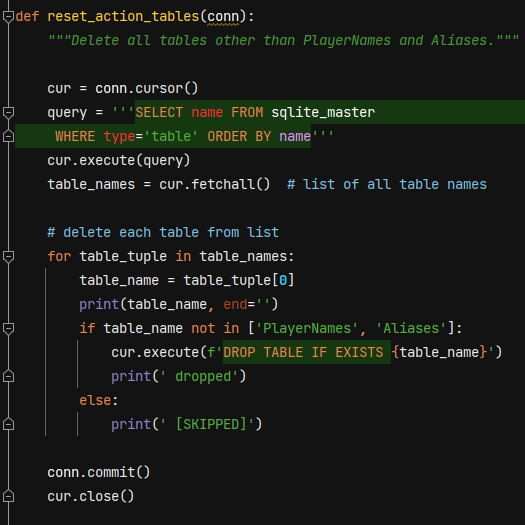
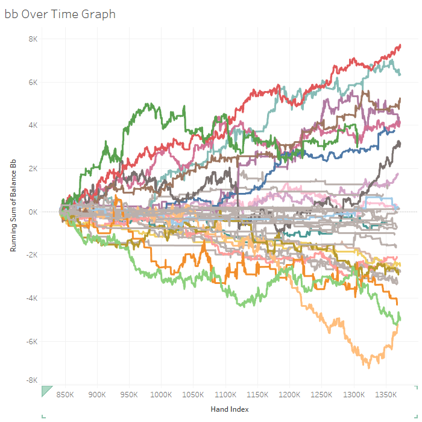

# Greg Lankenau  
### Not Your Ordinary Data Scientist
About Me
## Projects
### Poker Hand History Parser and Database
Python script that cleans and parses poker hand histories from PokerNow and loads them into a SQLite database  
  

### Poker Visualization
Tableau workbook that visualizes poker player strategies and statistics for better decision-making [[link]](https://public.tableau.com/app/profile/greg4796/viz/RebuyClub/WelcometotheRebuyClub)  

### Poker AI and Machine Learning Insights
Coming Soon
### NCAA March Madness Pool Optimizer
Java program that picks the optimal bracket for the NCAA basketball tournament
### Published Social Science Research
Peer-reviweed study that uses primarily quantitative statistical analysis to demonstrate that higher education can foster connectedness to nature  
* Lankenau, Greg. 2018. “Fostering Connectedness to Nature in Higher Education.” **Environmental Education Research** 24 (2): 230–44. doi:10.1080/13504622.2016.1225674 [[link]](https://doi.org/10.1080/13504622.2016.1225674)
### Dynamic Gradebook
28-sheet workbook using Google Sheets integrated with Google Forms for automated mail merge grade reports
## Technical Skills
### Programming
Python, Java  
* Projects: Poker Hand History Parser and Database | Poker AI and Machine Learning Insights | NCAA March Madness Pool Optimizer
### Machine Learning and Neural Networks
scikit-learn, Keras/TensorFlow  
* Project: Poker AI and Machine Learning Insights
### Data Visualization
Tableau, matplotlib, Seaborn  
* Project: Poker Visualization
### Relational Databases
MySQL, SQLite  
* Project: Poker Hand History Parser and Database
### Statistical and Numerical Analysis
NumPy, SPSS, MATLAB, Octave  
* Project: Published Social Science Research
### Data Analysis
Pandas, Excel, Google Sheets, NVivo  
* Project: Dynamic Gradebook
