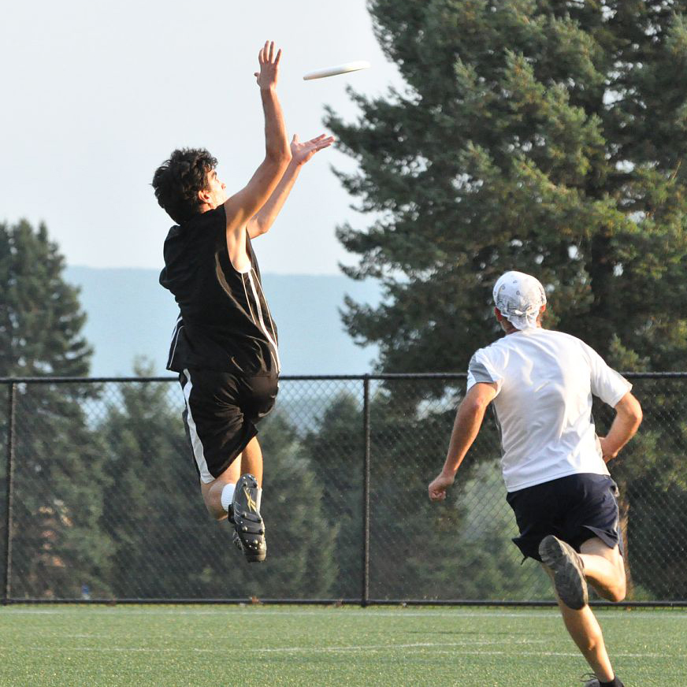
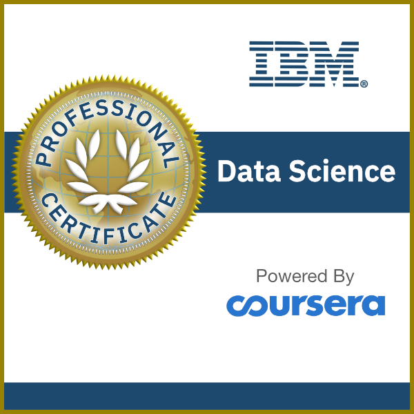

# About Me
Hi, I'm Greg, and I'm not your ordinary data scientist.

I'm a professional educator with years of experience as a **college instructor and assistant professor**, which means that I know how to communicate complex ideas in simple terms. I have an English minor with an emphasis in **creative writing**, so I know how to tell engaging stories, whether those stories are told through creative fiction or data science reports. I've taught college-level **public speaking** and know how to speak and present effectively, including how not to put audiences to sleep with technical information. (Which I know would never happen with an audience as sophisticated as you, right? Hey, are you still there? Hello?)

I'm a trained **PhD researcher** with a background in quantitative methods, qualitative methods, and computational methods, which means that I know how to ask questions in a variety of ways and find useful answers. My area of focus is **environmental sustainability**, and working towards a more just and sustainable world provides my work with meaning and fuels my passion for what I do. I would love to carry over this environmental focus into data science.

I'm a "Renaissance person" with a varied set of interests, which means that I can communicate effectively across domains to reach different audiences. Outside of data science, I enjoy playing poker, board games, and sports like basketball and ultimate Frisbee where tallness confers a commanding advantage (I'm 6'4"). I also like to have fun doing what I do, which (hopefully) is reflected in this portfolio sprinkled with (potentially) interesting stories and a dash of (now I'm really pushing it) humor.

Here's a photo of me doing tall person things:

## Contact Me

You can contact me at [LinkedIn](https://www.linkedin.com/in/greg-lankenau-70b51013/).

## Certifications

**[IBM Data Science Professional Certificate](https://www.credly.com/badges/d99318dc-807b-4d6d-9850-435f2c6d4f1d/public_url)**: Certifies readiness for a career in data science with a demonstrated ability to solve real-world problems.

## Technical Skills

This is a short list of my most relevant technical skills for data science. The list contains links to the same projects as the [Projects (Home)]("/") page, but organized by skill. Some projects are listed under more than one skill.

- **Programming:** Python, Java
    - Includes experience in **programming environments** like Jupyter Lab/Notebooks and GitHub
    - [Poker Hand History Parser and Database](parser)
    - [Poker AI and Machine Learning Insights](ai)
    - [NCAA March Madness Pool Optimizer](ncaa)
- **Machine Learning and Neural Networks:** scikit-learn, Keras/TensorFlow
    - [Poker AI and Machine Learning Insights](ai)
- **Data Visualization:** Tableau, matplotlib, Seaborn, Plotly/Dash
    - [Poker Visualization](visualization)
- **Relational Databases:** MySQL, SQLite
    - [Poker Hand History Parser and Database](parser)
- **Statistical and Numerical Analysis:** NumPy, SPSS, MATLAB, Octave
    - [Published Social Science Research](nature)
- **Data Analysis:** Pandas, Excel, Google Sheets, NVivo
    - [Dynamic Gradebook](gradebook)
- **Research Design**
    - [Published Social Science Research](nature)
- **Communication and Writing**
    - [NCAA March Madness Pool Optimizer](ncaa)
    - [COVID-19: What You Can Do](covid)
 
## Thank You

Thank you for visiting my portfolio!
