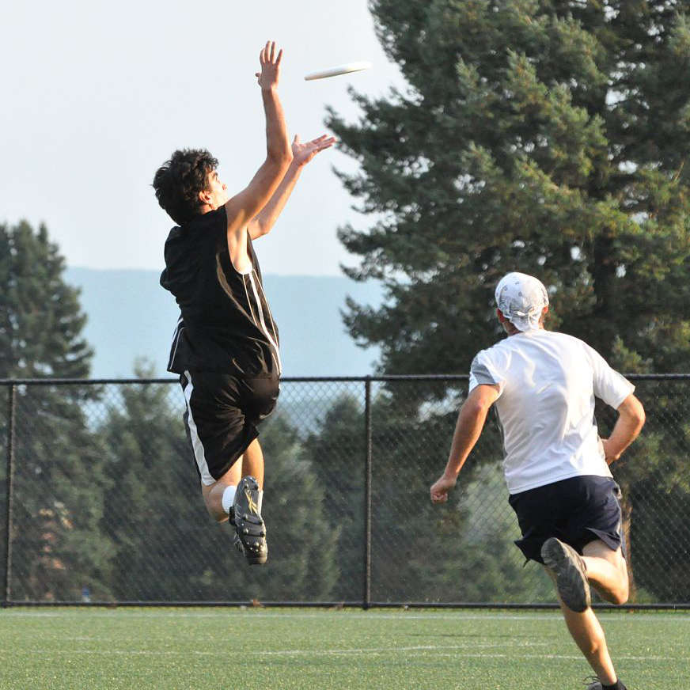

# About Me
Hi, I'm Greg.

## Data Scientist

I'm a data scientist who excels in **analytical problem-solving** with a contextual understanding of the big picture. My team leader noted that I **"think like a scientist"** in the way that I approach problems with curiosity and systematically analyze potential solutions. In my work I proactively anticipate and address issues; my supervisor has repeatedly mentioned how I can always be trusted to work independently while also thinking collaboratively. In a quarterly evaluation, my supervisor called me an "ideal data scientist."

## Former Educator

I'm a former educator with professional experience as a university instructor and assistant professor, which means that I know how to communicate complex ideas in simple terms. My aggregate rating on student evaluations is 4.8 out of 5; I'm good at what I do! I have an English minor with an emphasis in **creative writing**, so I know how to tell engaging stories, whether those stories are told through creative fiction or data science reports. I've taught college-level **public speaking** and know how to speak and present effectively, including how not to put audiences to sleep with technical information. (Which I know would never happen with an audience as sophisticated as you, right? Hey, are you still there? Hello?)

## PhD Researcher

I'm a PhD researcher with training in quantitative methods, qualitative methods, and computational methods, which means that I know how to ask questions in a variety of ways and find reliable answers. My area of focus is **environmental sustainability**, and working towards a more just and sustainable world provides my work with meaning and fuels my passion for what I do. I would love to carry over this environmental focus into data science.

## Renaissance Person

I'm a "Renaissance person" with a varied background and a wide set of skills and interests, which means that I can communicate effectively across domains to reach different audiences. I have graduate or undergraduate degrees in computer science, mathematics, systems science, women's studies, and geography. Outside of data science, I enjoy playing poker, board games, and sports like basketball and ultimate Frisbee where tallness confers a commanding advantage (I'm 6'4"). I also like to have fun doing what I do!

Here's a photo of me doing tall person things:

## Resume and Contact Info

For a resume of sorts, see my [Skills and Certifications](skills) page.

You can contact me at [LinkedIn](https://www.linkedin.com/in/greg-lankenau-70b51013/).

## The Take-Away Message

To complement my problem-solving ability as a data scientist, I am also a teacher, a researcher, a communicator, and an interesting (?) person. Thank you for viewing my portfolio!

*Note: The writing and structure of this portfolio is human-generated (by me!) without the use of LLMs or other AI tools. When showcasing my communication skills, it only makes sense if the communication is actually coming from me!*