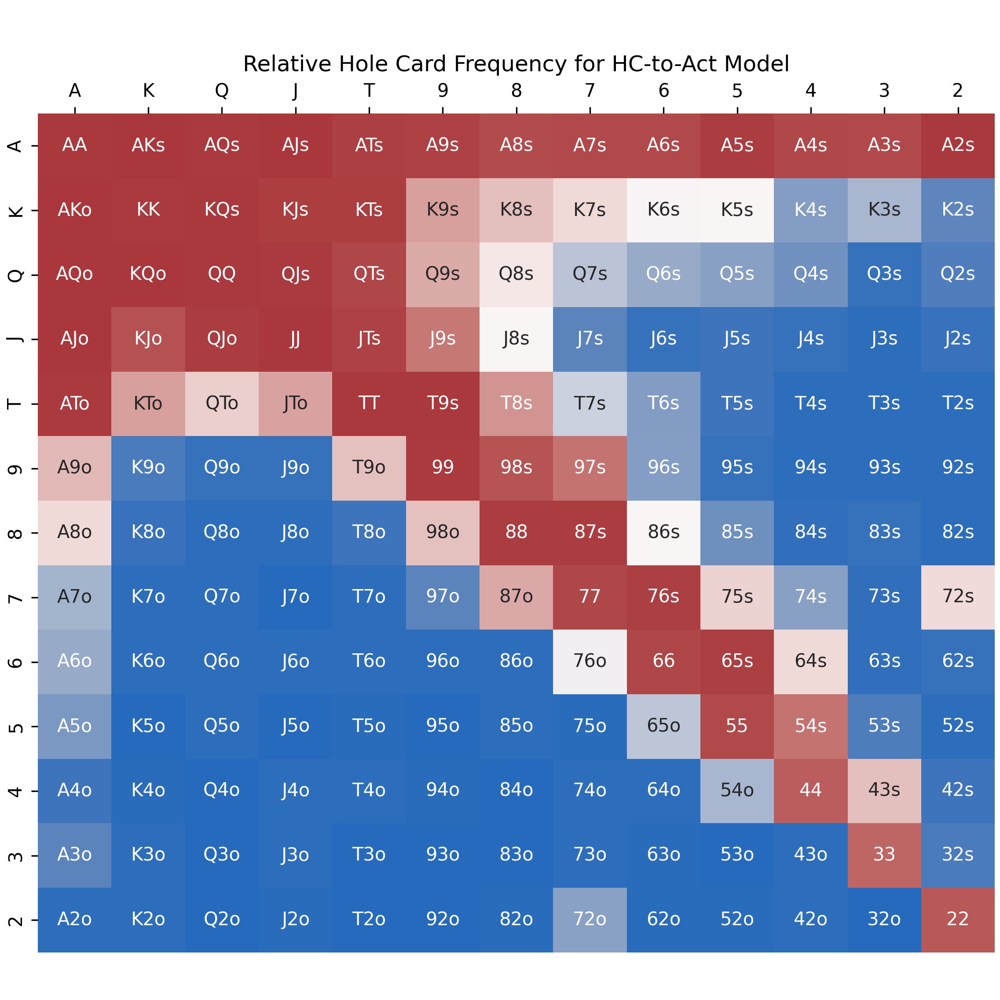
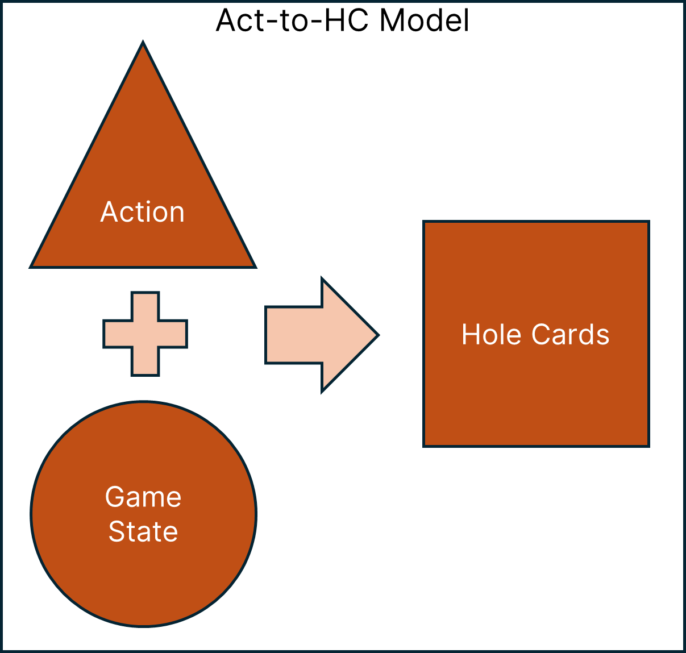
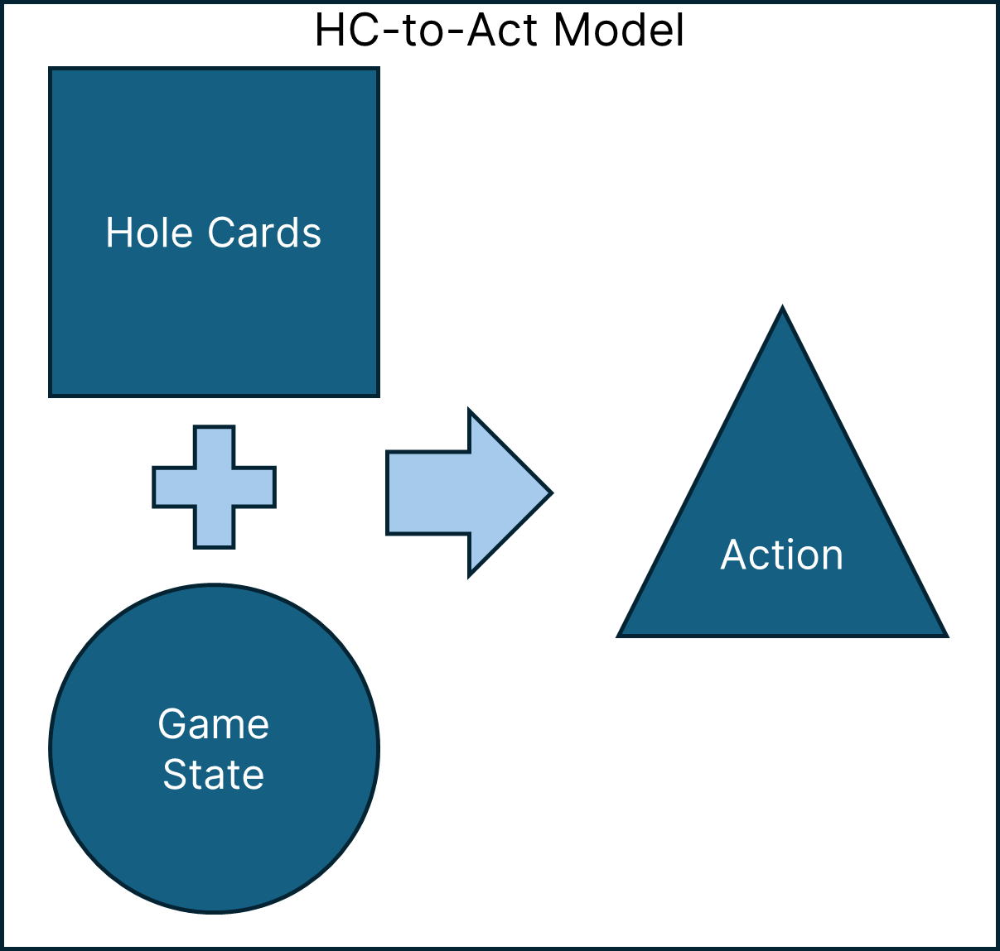
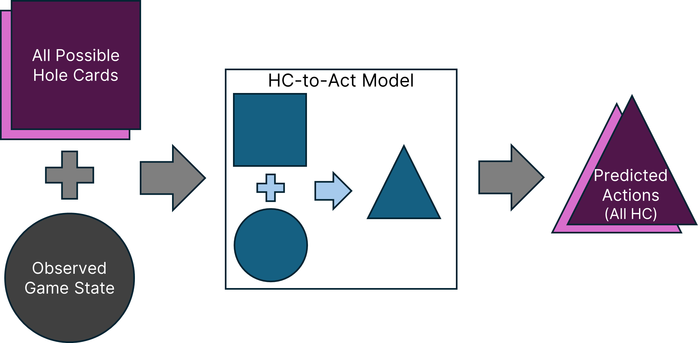
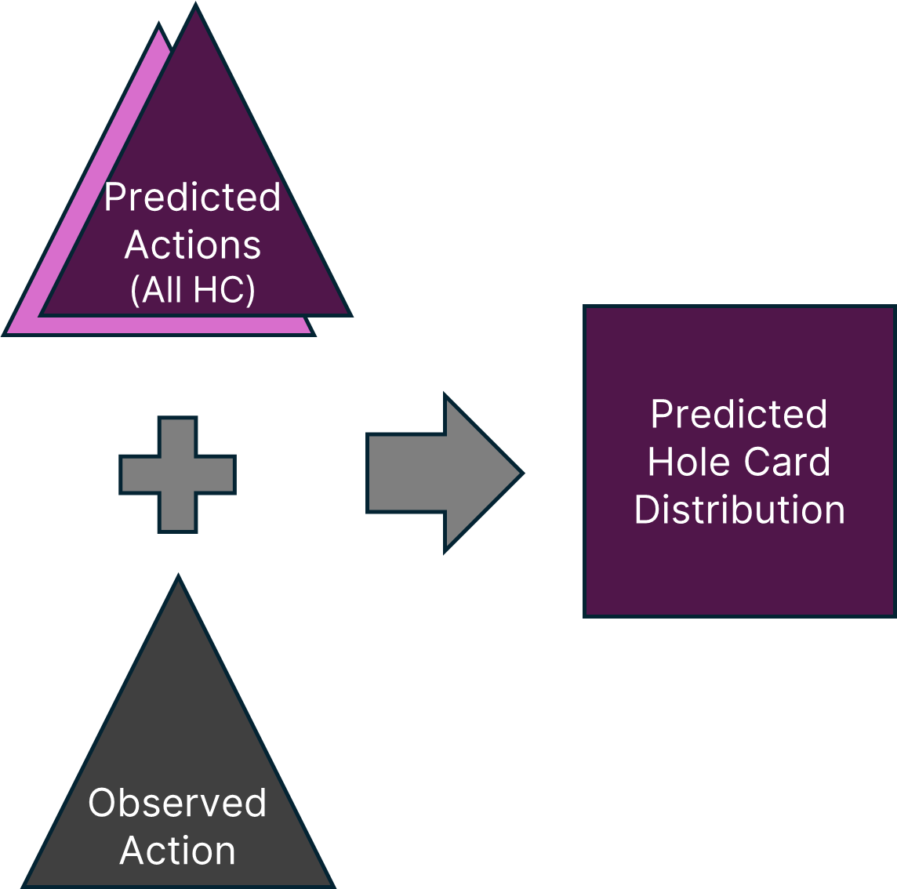

# Poker AI and Machine Learning Insights

## Overview

A set of projects that leverage machine learning and AI to derive advanced insights about poker strategy

*This image is just a teaser. Don't worry, there will be a clickable version later!*

### Skills
- Machine learning (scikit-learn)
- Deep learning (Keras/TensorFlow)
- Data analysis (Pandas, NumPy)
- Programming (Python)

### Background

Building on my [Poker Hand History Parser and Database](parser), I am currently working on a set of projects that use machine learning and deep learning to improve my poker play (and my opponents', if they are so inclined!). 

### Ethical Principle #1: My Own Play First

Ethically, since I play poker almost exclusively against friends, I want to take steps to ensure that I don't build an unfair advantage for myself with AI-driven insights. To level the playing field, whenever possible I will train the machine learning and AI models on *my own play first* and make these insights available to the rest of the group. This is like handing all of my opponents cheat codes to beating me, specifically!

### Ethical Principle #2: Never While Playing

These AI-driven models should only be used as study tools outside the game, *never while playing*. Using outside assistance during play (whether AI, human, or otherwise) is strictly against the rules of poker and endangers the fundamental existence of the game. As someone who greatly enjoys the game of poker, I feel very strongly about this point!

## Project Description: Hole Card Predictor

In Texas hold 'em poker, public community cards are face up on the table and known to all, plus each player has two private hole cards known only to them. Knowing, or at least being able to narrow down, an opponent's two hole cards is very valuable information that informs your optimal strategy in the hand. Can a machine learning model predict the range of hole cards that an opponent is holding, given the action in the hand so far?

We can visualize a player's two hole cards in a 13x13 grid, where the value of each card, (A)ce down to 2, is an axis. Here is the distribution of possible hole card hands a player can be dealt:

Pocket pairs (hole cards of equal rank) are along the diagonal, suited cards (cards where the suits match) are above the diagonal, and unsuited cards (cards where the suits do not mach) are below the diagonal. There are 13\*13=169 possible hands, but not every hand is equally likely. The grid is darkest below the diagonal because unsuited hands are the most common (~1% each), followed by pocket pairs (~0.5% each), followed by suited hands (~0.3% each). Note that the color scale used in this grid is the same scale used later, which is why there are no hands at the high end of the scale in this particular image.

The above grid would be our naive guess if we knew nothing about an opponent's hole cards. But let's see if we can do better.

### Example Game State

All of the models discussed below will use the same example player action and game state, "raise first in from the cutoff." This means:

- Preflop (only private hole cards have been dealt; no community cards yet)
- Everyone has folded to the player in the cutoff (one to the right of the dealer button)
- The cutoff raises

The question is, what range of hole cards does the cutoff have when raising first in?

### Mapping Actions to Hole Cards (Act-to-HC Model)

Using data from the hand history database, I trained a series of machine learning models to learn the mapping between a player's action and a given game state to the player's hole cards (action + game_state --> hole_cards). As shorthand, I refer to this kind of model as actions to hole cards, or "Act-to-HC":

Once trained, an Act-to-HC model can then be used to directly predict a player's range of hole cards given an observed player action and game state:

Consistent with ethical principle #1 (my own play first), here is the output of the random forest Act-to-HC model that predicts my range of hole cards when raising first in from the cutoff:

The Act-to-HC model is a success! These predicted frequencies very closely match the actual empirical frequencies from my own hand histories (we'll return to this point in a minute).

This range of hands is much more specific than a naive guess. Hands with an ace, especially an ace paired with another large card, are very often raised. Low, disconnected, and/or unsuited hands are very rarely raised. The grid is darkest below the diagonal because unsuited hands are more frequent than pocket pairs and suited hands.

Did you notice the seemingly anomalous 72s and 72o standing out from the rest? 72 is known for being the worst hand in poker, so some players in my poker group -- me included! -- sometimes try to win with it as a matter of entertainment/pride. And the random forest model picked up on that!

The Act-to-HC model is a success... but not very useful. 

A closer look at the grid reveals some discontinuities in the predictions, such as KK being notably less frequent than the adjacent AA and QQ. There is no reason for this; I will always raise AA, KK, and QQ first in from the cutoff, and as these pocket pairs are equally likely to be dealt, a robust model should predict these hands with equal probability. This is actually not an issue with the model, but the data. The empirically observed frequencies look just like this, which means that I was just dealt KK less often in this game state due to random variance. Even knowing the hole cards for every hand I've played (about 50,000 hands per year since 2021) doesn't provide enough data to smooth out these variations.

And that is the death knell for the Act-to-HC model for any data other than my own.

I have full knowledge of my private hole cards, whereas the hand histories don't show other players' private hole cards except in specific circumstances, such after winning at showdown or when players choose to show their cards voluntarily, which both limits and biases their known hands. If my treasure trove of known hands isn't enough to smooth out variance, the model is doomed when tasked with predicting hole cards from data that is significantly more limited and biased.

Using a model to predict hole cards requires thinking about the problem in a different way.

### Mapping Hole Cards to Actions (HC-to-Act Model)

Instead of training a model to directly predict a player's hole cards, what if we instead trained a model to play like a particular player? I trained a series of models to learn the mappings between a player's hole cards and a given game state to the player's action (hole_cards + game_state --> action). As shorthand, I refer to this kind of model as hole cards to actions, or "HC-to-Act":

What we really want to know, though, is a player's hole cards, which the HC-to-Act model takes as input, not provides as output. Here's where this gets interesting. If we provide the HC-to-Act model with all possible hole card hands and a given game state, it will predict the player's actions in that game state for every hole card hand they could be holding:

What we have now is a player's complete strategy for that game state! When presented with an observed player action, we can ask how consistent that action is with the player's strategy for each possible hole card hand. That gives us the player's predicted hole cards, which was our goal all along:

We've essentially "reverse engineered" a HC-to-Act model to predict the player's hole cards for an observed action and game state. Here is the output of the modified random forest HC-to-Act model that predicts my range of hole cards when raising first in from the cutoff:

Notice how much smoother this probability distribution is than the earlier Act-to-HC model (here's a link to <a href="images/ml/absolute_comparison" target="_blank">view them together</a>). For example, KK is no longer notably different than the adjacent AA and QQ. The modified HC-to-Act model provides a more robust prediction that is much less sensitive to the random variance of hole cards being dealt more or less often in particular game states.

To see why this is the case, here is a different visualization that is closer to what the HC-to-Act model outputs natively. This is the same HC-to-Act model prediction as above, but on a different scale. Instead of an absolute probability distribution that sums to one across all hole card hands, the following grid shows how often *each hole card hand* takes the observed action in the given game state. Red cells are close to 100%, which means that hand very often takes the observed action, whereas blue cells are close to 0%, which means that hand very rarely takes the observed action:

This blue-red "relative" visualization shows that I nearly always raise AA, KK, QQ, and many other hands first in from the cutoff. This is the core of why the HC-to-Act model is so much more robust. After a reasonable minimum number of hands, it doesn't matter if I've been dealt KK five times or five thousand times first in from the cutoff; if I always raise KK in that game state, the model will correctly assign the same absolute probability as other pocket pairs that I always raise.

From a human readability standpoint, I think this blue-red relative visualization is more informative than the orange absolute visualization from earlier. The blue-red relative visualization shows a player's strategy, and knowing an opponent's strategy is helpful for making human decisions while playing, whereas the orange absolute visualization shows probabilities that may be mathematically useful, but are less strategically useful in-game.

#### Bayes' Theorem Sneaks In

It may seem like magic that the HC-to-Act model can be "reverse engineered" to predict hole cards, but it's not magic, it's Bayes' theorem! Bayes theorem is a way to derive a conditional probability (a probability that depends on something else happening) when you know a bunch of other probabilities.

In a given game state, when we ask what hole cards a player is likely holding after taking a particular action, we are asking about the probability of their hole cards (HC) given the observed action (A), or P(HC | A). We don't know P(HC | A), but we do know

- P(A | HC): The probability of the player's actions given particular hole cards. This is the output of the HC-to-Act model, which we know.
- P(HC): The probability of a particular hole card hand. This is just the naive probability of being dealt that hand, which we know.
- P(A): The probability of a particular action. Since this is observed after the player actually takes an action, its value is simply 1.

Bayes theorem lets us put these probabilities together and solve for the one we don't know:

P(HC | A) \* P(A) = P(A | HC) \* P(HC)

Since P(A) = 1, all we have to do to determine P(HC | A) is divide the output of our Act-to-HC model (for all possible hole cards) by the naive hole card probabilities. This is what I was doing behind the scenes to translate the output of the Act-to-HC model into the orange absolute grid. Neat!

## What's Next?

To be continued...