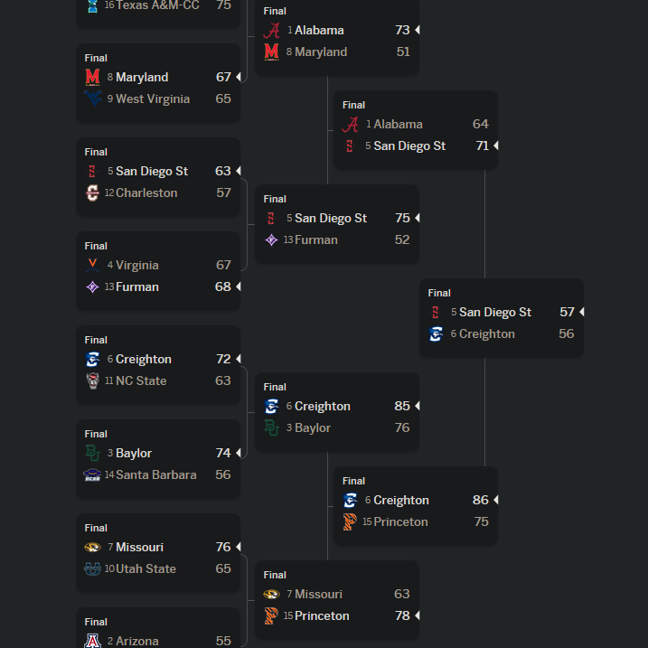
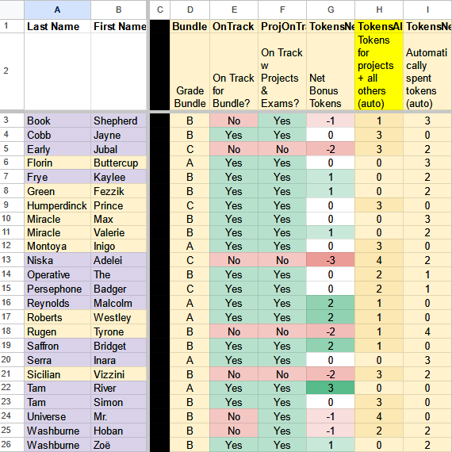

# Project Archive

These are older archived projects; I recommend viewing the projects on my homepage first!

If you like my writing, I tell a much-too-long story about the [NCAA March Madness Pool Optimizer](ncaa).

---
  
## [NCAA March Madness Pool Optimizer](ncaa)
Java program that picks the optimal NCAA basketball tournament bracket for a typical office pool

---
   
## [Dynamic Gradebook](gradebook)
28-sheet workbook using Google Sheets to collate student grades, instructor feedback, and peer feedback for automated mail merge grade reports

