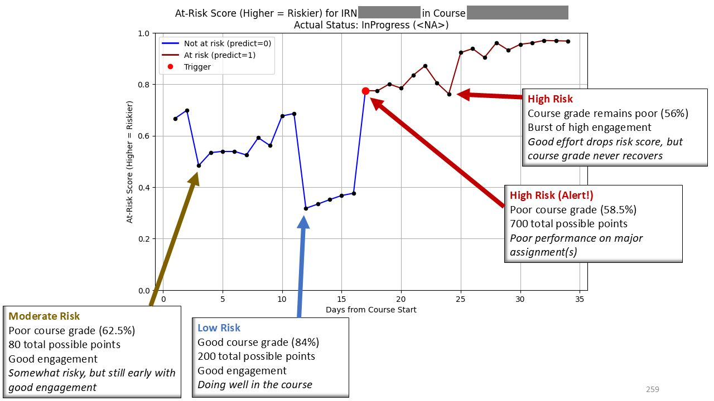

# bFusion Behavior Model

## Overview

Multi-stage factor analysis and gradient boosting model to predict student risk at multiple time scales

Model development in progress; preparing for pilot program

### Skills
- Programming (Python, Docker)
- Statistical and numerical analysis (Pandas, NumPy)
- Machine learning (scikit-learn, XGBoost)
- Relational databases (Amazon Redshift/PostgreSQL)
- Cloud Computing and AWS Deployment (AWS SageMaker, Apache Airflow)

## The Take-Away Message

Page in progress