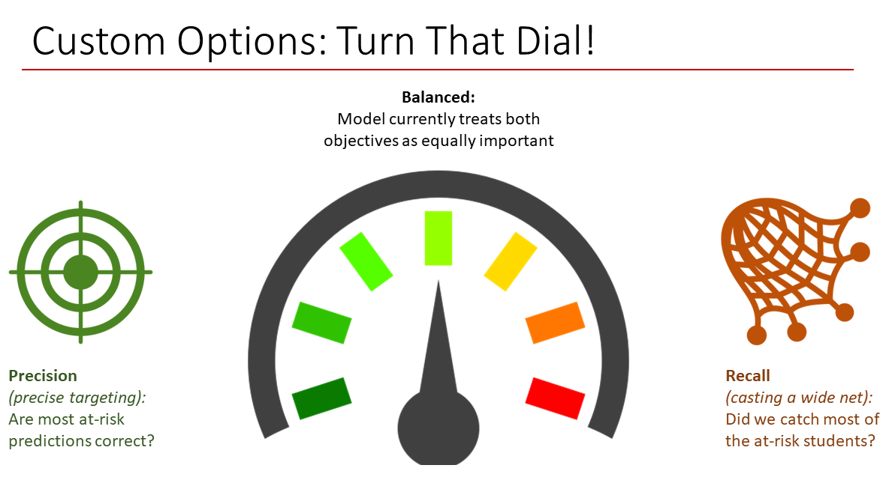

# Student Risk Model

## Overview

Multi-stage optimization and logistic regression model to identify at-risk students

*Key business outcome:* Increased student success rate by 9% while reducing advisor case load by 32% vs. previous strategy. Increased student revenue while reducing advisor costs.

### Skills
- Programming (Python, Docker)
- Statistical and numerical analysis (Pandas, NumPy)
- Machine learning (scikit-learn)
- Relational databases (Amazon Redshift/PostgreSQL)
- Cloud Computing and AWS Deployment (AWS SageMaker, Apache Airflow)

## The Take-Away Message

Page in progress