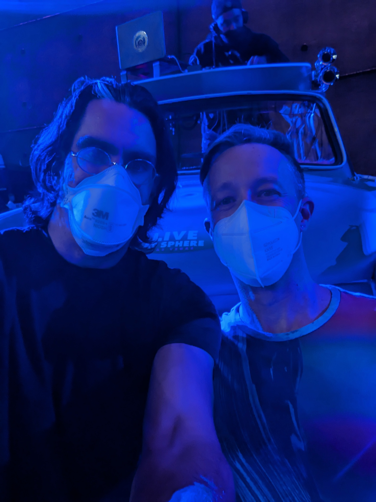
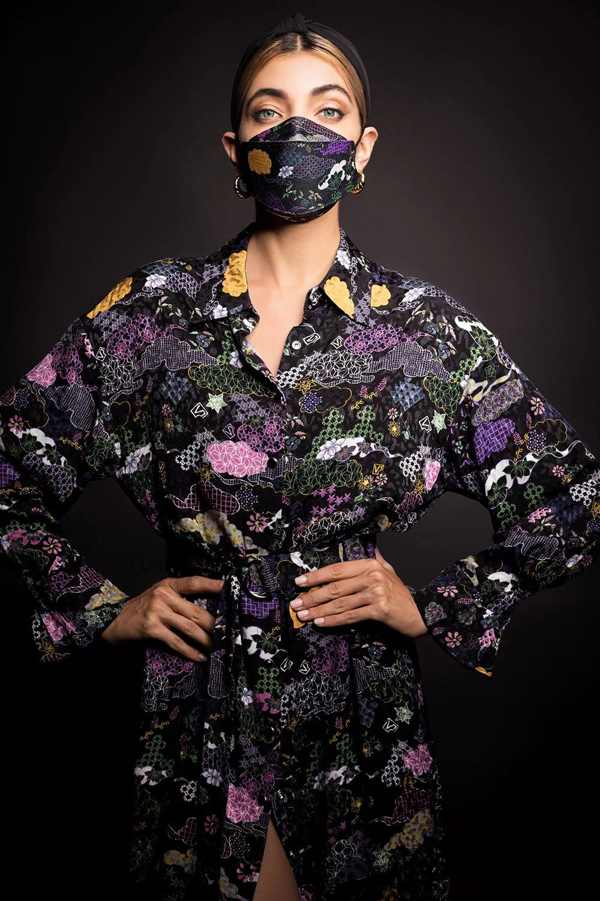
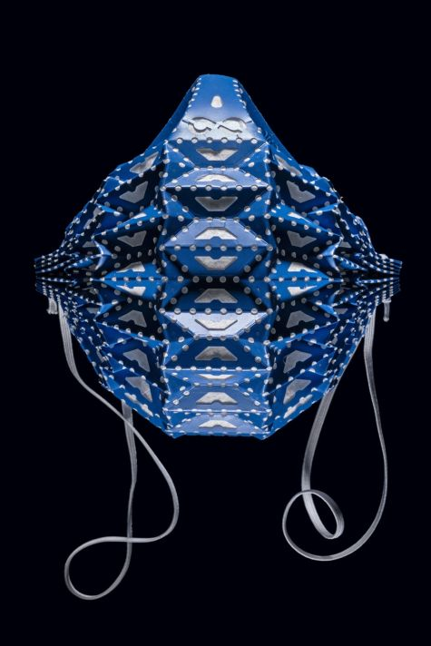
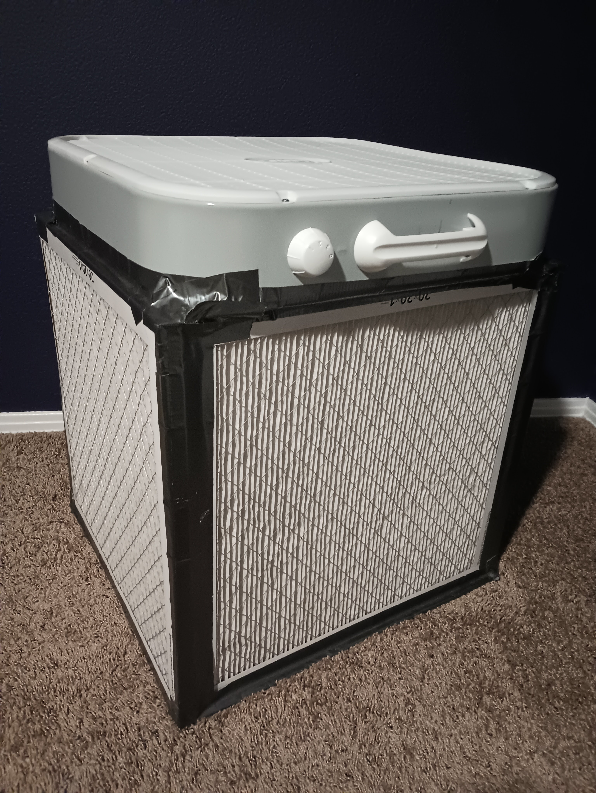
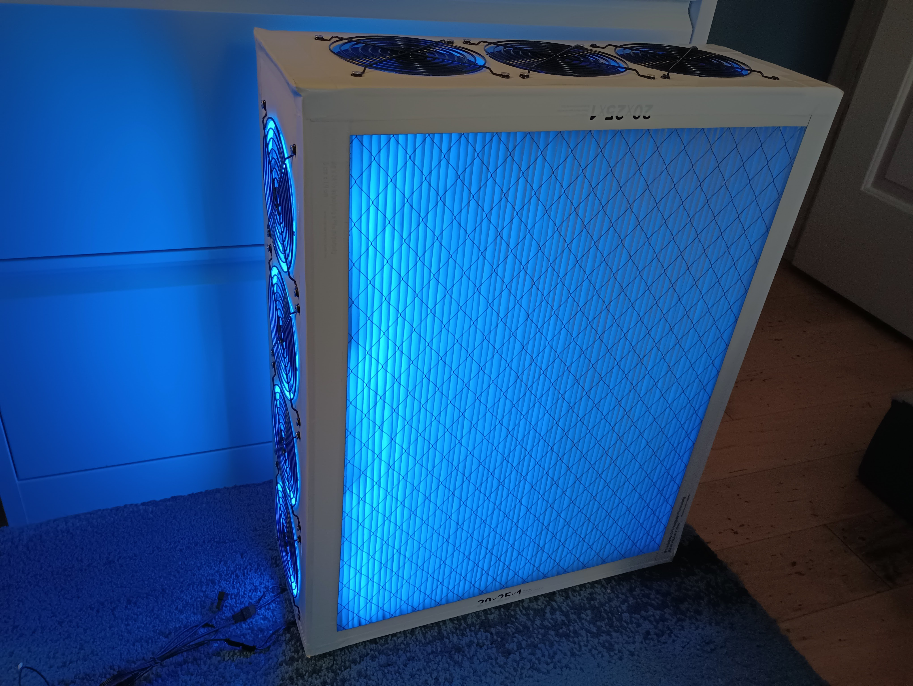

# COVID-19: What You Can Do

*Sources updated on April 4, 2024*

## Overview

This is a lightly-edited adaptation of an email I wrote to my poker group. I am including it in my data science portfolio because it
- Is a good example of how data can inform decision-making in all aspects of life
- Demonstrates how I write and communicate (yes, I include headers and formatted links in my emails... at least the important ones!)
- Is part of a conversation that I would like to see happening more openly and frequently

I am not an expert on COVID-19, but I do try to make decisions based on the best available evidence. If the information below is misleading or incorrect, or if you have links to information that is better (newer, more thorough, more strongly established, more rigorous, more accessible, and/or more effectively communicated), please let me know and I will update this page!

For another example of my communication style, see my [NCAA March Madness Pool Optimizer](ncaa) project.

### Email Context

In October 2023, I attended a concert in Las Vegas (U2 at the Sphere -- amazing!). I play poker regularly with an online group that uses audio/video chat via Discord while playing. A number of my poker-playing friends wanted to hear about the experience, so I wrote an email to the group talking about the concert and my poker-playing adventures.

In a follow-up email I also wrote a description of what I did behind the scenes to make the concert trip safer in the era of COVID-19. [From a sociological perspective](https://www.agjohnson.us/glad/arent-systems-just-people/), I stepped off the path of least resistance by taking COVID-19 precautions, and I needed to be vocal and visible about why.

My follow-up email is below, lightly edited and with some updated sources.

# Greg's COVID-19 Email

All right, I know you all have been waiting in suspense for the Vegas Follow-Up Email!

I think it's important to start shifting the social norms around COVID-19 to a more open and frank discussion of what it looks like to act responsibly while engaging in the activities that we enjoy. If I share my U2 story without sharing the activities that happened behind the scenes to make it relatively safer, then that just gives the false impression that it's not necessary to take any steps at all. So let's start that frank and open discussion!

## TL;DR Links

This email is long and includes a gaggle of links. I included so many links because they show the evidence that lead to these claims, and they provide additional information if you would like to dig into a particular topic. If you'd like to learn more but don't know where to start, here is a short list of what I consider to be the best resources. All of these are accessible for a general audience; for more rigorous scientific studies and meta analyses, check out the rest of the email. :)

- **Current prevalence of COVID-19 in the U.S.:** The People's CDC and their weekly [COVID-19 Weather Report](https://peoplescdc.org/weatherreports/)
- **Overview of Long COVID effects:** The summary from Johns Hopkins Medicine: [Long COVID: Long-Term Effects of COVID-19](https://www.hopkinsmedicine.org/health/conditions-and-diseases/coronavirus/covid-long-haulers-long-term-effects-of-covid19)
- **Long-term effects of COVID-19 on the brain:** Ziyad Al-Aly's article in *The Conversation*: [Mounting research shows that COVID-19 leaves its mark on the brain, including with significant drops in IQ scores](https://theconversation.com/mounting-research-shows-that-covid-19-leaves-its-mark-on-the-brain-including-with-significant-drops-in-iq-scores-224216)
- **Re-framing COVID-19 as a matter of public health** (instead of as an individual "choice"): Ed Yong's article in *The Atlantic*: [The Fundamental Question of the Pandemic is Shifting](https://www.theatlantic.com/health/archive/2021/06/individualism-still-spoiling-pandemic-response/619133/)
- **Using multiple layers of protection to prevent the spread of COVID-19:** The People's CDC and their [Layers of Protection](https://peoplescdc.org/2022/09/12/layers-of-protection/) page
- **How masking works, why it's important, and where to find high-quality masks:** The People's CDC and their [Masking page](https://peoplescdc.org/2022/09/12/masking/)
- **Most effective masks:** ([3M Aura N95](https://www.amazon.com/gp/product/B095FJ36H2) (the default gold standard), [Generic KF94](https://www.amazon.com/Packs-PUREMATE-Individual-Wrapped-Pattern/dp/B09HV14Q1R), or [WWDOLL KN95](https://www.amazon.com/KN95-WWDOLL-Efficiency%E2%89%A595-Protection-Pollution/dp/B08Q8HKCTW)
- **Choosing an air filter for COVID-19:** Guide from the National Institute of Environmental Health Sciences: [Selection and Use of Portable Air Cleaners](https://tools.niehs.nih.gov/wetp/public/hasl_get_blob.cfm?ID=13021)
    - Easy version: A HEPA filter like the [Levoit Core 200S](https://www.amazon.com/gp/product/B08FJ678YK) (or larger)
    - Cheapo version: Build a [Corsi-Rosenthal box](https://cleanaircrew.org/box-fan-filters/)

## What Greg Teaches His Students

I teach a course on scientific and information literacy and a course on gender communication, and one of our case studies in each class is COVID-19. There is a lot that the medical and scientific community knows regarding COVID-19 that we don't hear much about, in part because it's not good news, and most people are exhausted by all the bad news and just want to live their lives.

It takes courage to look at the medical and scientific evidence, and it takes courage to adjust our behavior in light of that evidence. Here are the big four takeaway messages that my courses emphasize about the medical and scientific evidence of COVID-19:

### 1. COVID-19 is widespread in the United States
We hear less about the prevalence of COVID-19 now in part because public health agencies like the CDC have actually [stopped monitoring](https://www.forbes.com/sites/brucelee/2023/04/29/cdc-will-stop-tracking-covid-19-community-levels-here-are-the-problems/?sh=32a4dc4e4bb3) community-level transmission of the virus. But *not knowing* about it does not make the virus disappear! The best information we have comes from analyzing wastewater; currently, [national wastewater data](https://biobot.io/data/) shows many times higher levels of SARS-CoV-2 (the virus that causes COVID-19) than in May 2021, when the pandemic was at its low point. The weekly [COVID-19 Weather Report](https://peoplescdc.org/weatherreports/) from The People's CDC is my go-to source for the most up-to-date information about COVID-19 in the U.S.

### 2. The long-term health risks of COVID-19 are serious, even for mild cases
COVID-19 is responsible for over [a million deaths](https://covid.cdc.gov/covid-data-tracker/#trends_totaldeaths_select_00) in the United States (more than suffering a new September 11 terrorist attack every day for a year), which is an incredible loss. But perhaps more insidious is that even mild cases of COVID-19 lead to long-term health effects ("long COVID") for somewhere between [one in ten](https://jamanetwork.com/journals/jama/fullarticle/2805540) and [one in three](https://academic.oup.com/jid/article/226/9/1593/6569364) people, including [children and adolescents](https://www.cidrap.umn.edu/covid-19/not-little-adults-experts-say-long-covid-undercounted-misdiagnosed-kids). Every COVID-19 infection, even a mild one, carries the risk of long COVID; [90% of people](https://theconversation.com/long-covid-stemmed-from-mild-cases-of-covid-19-in-most-people-according-to-a-new-multicountry-study-195707) living with long COVID initially experienced only a mild case of COVID-19. People who contract COVID-19 more than once are [particularly at risk](https://medicine.wustl.edu/news/repeat-covid-19-infections-increase-risk-of-organ-failure-death/).

Long COVID presents with [dozens of long-term symptoms](https://www.nature.com/articles/s41591-022-01909-w), indicating [damage to organs](https://www.hopkinsmedicine.org/health/conditions-and-diseases/coronavirus/covid-long-haulers-long-term-effects-of-covid19) like the brain, lungs, heart, kidneys, liver, and/or [multi-organ effects](https://www.jacc.org/doi/abs/10.1016/j.jacbts.2021.07.002) that involve many body systems. I don't think the implications of long COVID are talked about enough; personally, I find the [long-term](https://www.npr.org/sections/health-shots/2023/11/13/1211989263/pain-fatigue-brain-fog-long-covid-neurological-effects) effects [on the brain](https://link.springer.com/article/10.1007/s00439-023-02549-x) the most disturbing (including a measurable [drop in IQ scores](https://theconversation.com/mounting-research-shows-that-covid-19-leaves-its-mark-on-the-brain-including-with-significant-drops-in-iq-scores-224216)). When juggling large amounts of emerging scientific information, I look to meta-analysis studies for the most complete and rigorous (though highly technical) analysis, such as [Davis et al. in *Nature*](https://www.nature.com/articles/s41579-022-00846-2). But I also like to consider the human element, like this Guardian piece about readers who are [living with long COVID](https://www.theguardian.com/society/2022/oct/25/long-covid-fight-guardian-readers).

### 3. Good masks and good ventilation are effective at preventing the spread of COVID-19
This isn't all doom and gloom! This is actually *great* news: the virus that causes COVID-19 (SARS-CoV-2) is airborne, so face coverings (specifically, [K95, KN95, or KF94 masks](https://www.cdc.gov/mmwr/volumes/71/wr/mm7106e1.htm)) and good ventilation are [highly effective](https://www.sciencedaily.com/releases/2022/04/220413141610.htm) at reducing its transmission. I have lots of juicy things to say about masks and ventilation later in this email. You can find where [free N95 masks](https://www.cdc.gov/coronavirus/2019-ncov/your-health/free-masks.html) are available via the CDC website, and for some bangin' information about masking and how to find reliable K95/KN95/KF94 masks, check out the [Masking](https://peoplescdc.org/2022/09/12/masking/) page at The People's CDC.

### 4. COVID-19 is not a matter of personal risk tolerance; it is a matter of public health
Of all the take-away messages about COVID-19, this one is probably the most important. It's not as much about the science as it is about the *framing* of how we think and talk about COVID-19. We're used to thinking and talking about responsible behavior like masking as a personal choice, but a more expansive framing recognizes that ***masking protects everyone by stopping the spread of the virus***.

With a communicable disease like COVID-19, everyone's behavior affects everyone else's health, just like 'choosing' to smoke in a public place. The responsible choice is to choose not to spread the virus to others, even unknowingly. At least [one in three people](https://www.ncbi.nlm.nih.gov/pmc/articles/PMC9321237/) infected with COVID-19 show no symptoms, which means that people can spread the disease for [multiple days](https://link.springer.com/article/10.1007/s15010-021-01682-x) before and after showing symptoms, or without showing symptoms at all. Taking steps like [masking](https://journals.asm.org/doi/10.1128/msphere.00637-20) is important because ***that is how we stop the spread of the virus*** and protect everyone from contracting COVID-19. Ed Yong has a great article
([among many](https://www.theatlantic.com/author/ed-yong/)) in *The Atlantic* about what it looks like to frame COVID-19 as [a matter of public health](https://www.theatlantic.com/health/archive/2021/06/individualism-still-spoiling-pandemic-response/619133/).

## What You Can Do: Masking

This is my favorite part! There are lots of cool things you and I can do to stop the spread of COVID-19 and make activities like going to a U2 concert a reasonable possibility. I like to think in terms of [layers of protection](https://peoplescdc.org/2022/09/12/layers-of-protection/); each action by itself is a minor improvement, but together all these actions make a formidable whole. Actions like masking!

Masks are great! As noted by the [Dread Pirate Roberts](https://www.youtube.com/watch?app=desktop&v=1HnvQM465zM), "it's just that they're terribly comfortable; I think everyone will be wearing them in the future." I have boxes and boxes of masks at home. I carry different sizes and shapes of masks for my students and give them one whenever they need it. Wearing a certified N95, KN95, or KF94 mask that fits your face without gaps is the key, so find what works best for you! Here are my personal favorites:

#### The gold standard: [3M Aura N95](https://www.amazon.com/gp/product/B095FJ36H2)
N95 masks (made in USA) are tested to filter at least 95% of airborne particles. The 3M Aura N95 is the gold standard, and personally fits me the best without any gaps or air leakage, which means it also doesn't fog my glasses. This is what I wore during my Vegas trip any time I was in a public indoor space, including in the airports and flights, at the concert, and in the casinos. And let me tell you, it's a huge advantage at the poker table! It makes me look mysterious (a fellow player called me [Bane](https://www.youtube.com/watch?v=rAxJ5EFu2Co), and of course I did my best impression), hides many of my stupid-obvious tells, and lets me mutter out loud about the hand and/or my idiot opponents, just like I do playing against you degenerates when I'm on mute.

 
<i>My friend and me in our masks at the U2 concert. Spread the love of music, not the virus!</i>

#### The convenient option: [Generic KF94](https://www.amazon.com/Packs-PUREMATE-Individual-Wrapped-Pattern/dp/B09HV14Q1R) or [WWDOLL KN95](https://www.amazon.com/KN95-WWDOLL-Efficiency%E2%89%A595-Protection-Pollution/dp/B08Q8HKCTW)
KF94 (made in Korea) and KN95 (made in China) masks are tested to filter at least 94-95% of airborne particles. KF94 and KN95 masks usually attach with ear loops, which makes them more convenient for taking them on and off during short periods of time (just make sure your mask still forms a tight seal and fits your face without gaps). They also come in a wide variety of colors and sizes. I find it easier to talk and be understood while wearing a KF94 or KN95 compared to an N95, so I wear a KF94 when I teach, and I wore one around the house after I returned home until I was sure that I wasn't contagious. Since KF94 and KN95 masks are imported, brands are constantly going in and out of stock on Amazon, and it takes some effort to verify that they are legit. Before ordering a brand for the first time, I usually cross-reference it against the [MaskNerd testing data](https://docs.google.com/spreadsheets/d/1M0mdNLpTWEGcluK6hh5LjjcFixwmOG853Ff45d3O-L0/htmlview?usp=drive_web&ouid=108355114845682180386&pru=AAABfniWips*ZW4K5ipiMBIUEgzyHDB1eA) by Aaron Collins and/or the testing data from [Armburst USA](https://www.armbrustusa.com/pages/mask-testing/). Fortunately, the WWDOLL KN95 masks seem to be available fairly reliably.

#### The fashionable option: [MaskLab KF94](https://masklab.us/collections/kf-series)
I don't teach in any ol' KF94; I teach in fashionable KF94 masks from MaskLab that are color-coordinated to my outfit. I'm talking purple ombre, black "sacred geometry," blue "waves of hope," and red Vivienne Tam "city camouflage." One of the other social norms I'm conscious of changing is re-framing masks as fashion accessories, the way people enjoy purses or watches. My students constantly talk about what I'm wearing, which is the point. Wearing a mask can be fun if we do it right!

 
<i>Note: not an actual photo of me</i>

#### The special occasion: [Airgami](https://www.airgami.life/collections) (now sold out)
For my brother's wedding, I sported an Airgami, which is a super-fancy origami-style mask that I bought for super-special occasions. This thing is gorgeous and a compliment magnet! Too bad they are now sold out. There might be an actual photo out there of me getting down on the dance floor to YMCA or Shake It Off wearing my Airgami, but you will have to settle for a product photo.

 
<i>An Airgami for super-special occasions</i>

### When to Wear Masks

In everyday life, the situations where it is important to wear a mask are the [three C's](https://www.who.int/brunei/news/infographics---english):
- **Crowded spaces** with many people
- **Close-contact settings** with people nearby
- **Confined/enclosed spaces** with poor ventilation.

For example, I wear a mask in public indoor spaces like the grocery store and at crowded outdoor spaces like sporting events. Some spaces like my classroom hit all three C's and are very high risk for transmission, so I require students to wear masks, as well. The more people wear masks, the more it becomes 'normal' and acceptable for others to do so!

## What You Can Do: Ventilation

As you might have inferred from the three Cs, good ventilation is important. Because the virus is airborne, opening windows helps, and being outdoors helps a lot. When going out to eat, it's very easy to click the checkbox on Yelp that filters for outdoor seating:

 
<i>Click that "outdoor seating" option!</i>

You can clean indoor air with air filters, and this is where my inner nerd really comes out to play. Air filters that remove small airborne particles in the 0.1-1 micron range (HEPA filters do this) are effective at [reducing SARS-CoV-2 and other viruses](https://www.epa.gov/coronavirus/air-cleaners-hvac-filters-and-coronavirus-covid-19) in the air. There are three great options for buying -- or building! -- air filters capable of reducing COVID-19:

#### The easy option: Buy a HEPA air filter
The higher Clean Air Delivery Rate (CADR) the better, though the cost and noise goes up with the amount of clean air that a filter is capable of pushing through. Product descriptions often list the square footage of a room that the filter is capable of cleaning; this is usually one air change per hour at the filter's maximum speed. You want multiple air changes per hour (commercial buildings do [5+ air changes per hour](https://www.cdc.gov/coronavirus/2019-ncov/community/ventilation.html)), so get a filter that's rated for a room that's many times larger than the one you'll use it in. For more information about choosing an air filter, here's a [thorough guide](https://tools.niehs.nih.gov/wetp/public/hasl_get_blob.cfm?ID=13021) from the National Institute of Environmental Health Sciences.

I really like the [Levoit Core 200S](https://www.amazon.com/gp/product/B08FJ678YK) HEPA air filter, which is small enough to fit in my carry-on luggage! This is what I brought with me to Vegas and kept running in our hotel room, so my friend and I could hang out (and sleep) without masks. At night it also handily doubles as a white noise machine. There are air filters smaller than this, but any smaller than this is too small to be effective in a hotel room.

#### The cheapo option: [Build a Corsi-Rosenthal box](https://cleanaircrew.org/box-fan-filters/)
A Corsi-Rosenthal (CR) box is just a set of furnace air filters duct taped together into a cube, with a department-store box fan duct taped to the top (the fan sucks in air through the filter cube and blows clean air out the top). A CR box is amazing and offers an incredible bang for the buck! It has a much higher [Clean Air Delivery Rate per dollar](https://itsairborne.com/comparing-hepa-filters-and-the-corsi-rosenthal-box-a8b6d03af905) than any store-bought HEPA air filter I know of, and it's fun to build. Instructions are in the link; just make sure to get high-quality furnace filters rated MERV 13 or higher (3M Filtrete 1900+ MPR filters are the best; you can get them in cheap four-packs at [Costco](https://www.costco.com/3m-2500-series-filtrete-1%22-filter%2C-4-pack.product.4000181409.html), [Amazon](https://www.amazon.com/gp/product/B005GZ8IG2), etc). Any generic 20" box fan will do; I got [this one](https://www.homedepot.com/p/Lasko-20-in-3-Speeds-Box-Fan-in-White-with-Save-Smart-Technology-for-Energy-Efficiency-Carry-Handle-B20201/203072133). My CR box gets tons of use at home, and it works very well as an aforementioned white noise machine at night. Here it is, in all its boxy glory:

 
<i>My mighty, mighty CR box</i>

#### The fancy DIY option: [Build a CR box with PC fans](https://itsairborne.com/busy-mom-builds-a-pc-fan-corsi-rosenthal-box-c64a56bae528)!
The basic CR box is great, but loud (white noise machine, remember) and ugly as sin, and I wanted something prettier to run all the time after I returned home from my trip that wouldn't be disruptive. So I built not one, but two CR boxes that use quiet PC fans instead of a box fan. The PC fan CR boxes are nearly silent, thinner... and light up in an array of LED colors, bro! Check this gorgeous thing out:
    

 
<i>One of my silent, bedazzled PC fan CR boxes</i>

I love these friggin' things, and after I returned from Vegas I kept the PC fan boxes running 24/7 in whatever room I was hanging out in (unmasked in my own office/bedroom and while eating, but masked otherwise). However, they were a lot more difficult to build than I expected, and they weren't cheap (I built two because the economies of scale worked better that way), so I'd only recommend the PC fan option for die-hard DIYers or for people who really want silent air filters. I used [140mm Arctic fans](https://www.amazon.com/gp/product/B07HCKWF2X), which are larger than the ones used in the linked instructions; let me know if you want to go down this route, and I'll give you some pointers I learned the hard way.

## Attending the Concert... And Other Cool Things

Masking and ventilation are two things you and I can do to stop the spread of the virus, and are two of the layers in the [layers of protection](https://peoplescdc.org/2022/09/12/layers-of-protection/) that can protect everyone's health. Other layers include vaccination, testing, and limiting our and others' exposure. All together, these layers are what went on behind the scenes to make attending the U2 concert relatively safer for me and everyone around me.

I think it's important to foster frank and open conversations like these about COVID-19 and other public health issues so that we know what choices are available and how to make them. It's hard to keep up with the current medical and scientific research, but it's even harder to want to, and to be willing to make changes to the way we live our lives. Thanks for sticking with me for this whole conversation. I'm happy to answer whatever questions I can, or point you to the people who know much more than I do.

The really good news is now that I have a routine with the smorgasbord of masks, the HEPA filter in the carry-on, the bedazzled CR boxes, etc, I have the foundation to fly across the country to hang out with you and lose all my money playing poker! Let's see if we can make it happen next summer!

## The Take-Away Message

After I returned from my Vegas trip, I used masking, CR boxes, open windows, and social distancing (sleeping in the guest room/office), because that's the biggest lesson of all from the medical and scientific community: ***this is how we stop the spread of the virus.***

I don't want to get COVID-19, but more importantly, I don't want *anyone* to get COVID-19, especially the people I care about the most (and for those who have already had it, I don't want them to get it again). I don't want to contribute to the virus's spread, and I don't want to contribute to the virus's continued evolution. I don't want people who are immunocompromised to live trapped inside their houses forever. I want to do the right thing, and I want to help other people
do the same!
