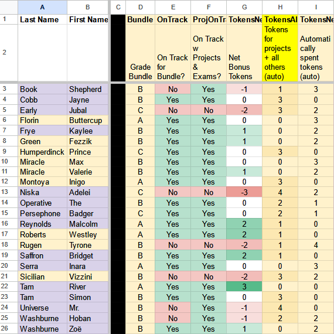
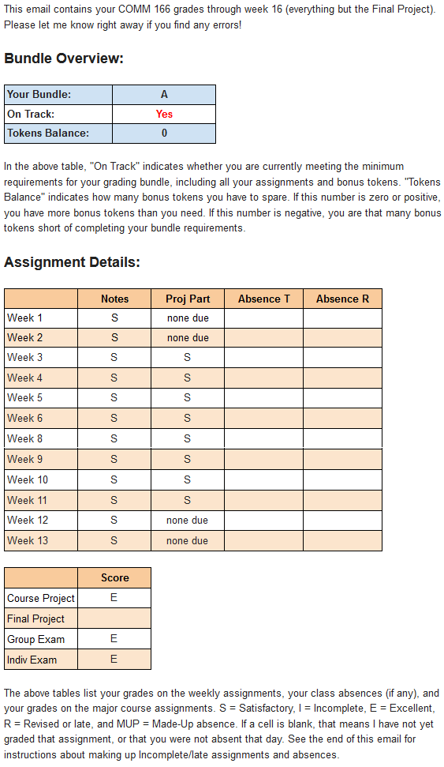

# Dynamic Gradebook

## Overview

28-sheet workbook using Google Sheets integrated with Google Forms for automated mail merge grade reports

### Skills
- Data Analysis (Google Sheets and plugins)

### Background

I teach interactive and discussion-based courses with the aim of connecting course material to students' everyday lives. Because of this, I don't have the typical kind of assignments like quizzes and exams that a lecture-based course would have. Instead, I have assignments like peer-graded reading reflections and open-ended options for course participation. My courses often use bundle grading, which is an approach to grading that allows students to earn a grade in the course by choosing, and then completing, a bundle of requirements stipulated ahead of time.

These non-standard assignments and grading requirements mean that typical learning management systems (e.g. Instructure Canvas) don't have a gradebook flexible enough to accommodate my courses. Instead, I have to create my own dynamic gradebook with an interface for students.

## Project Description

My dynamic gradebooks are Google Sheets workbooks integrated with Google Forms. Each course has its own gradebook; the most complex gradebook has 28 sheets within the workbook.

### Google Forms Integration

Integrating with Google Forms allows students to enter information into the gradebook. Along with the plugin, Form Ranger, the dynamic gradebook allows students to
- Enter grades for peer-graded assignments
- Provide feedback for peer-reviewed assignments
- Choose group members and grade bundles
- Check in regularly

### Mail Merge Grade Reports

On the other side of the coin, students need to be able to access their grades and track their progress. Each week I use the gradebook to send automated mail merge grade reports (via the plugin, Yet Another Mail Merge) to the students' email addresses, complete with assignment scores and progress towards their selected grade bundle.

Some major assignments like the peer-reviewed research project in my research methods course combine both student input via Google Forms and a mail merge report summarizing the student feedback. The mail merge report provides students with a 26-item checklist and written feedback synthesized from up to four peer reviewers.

### Example Grade Report

Here is an example of the automated mail merge grade report that students receive weekly:

---

---

### The Take-Away Message

I use Google Sheets, integrated with Google Forms and various plugins, to overcome the limitations of traditional gradebooks. A little bit of spreadsheet wizardry allows me to facilitate a more creative, open-ended, and personal learning experience for students.
