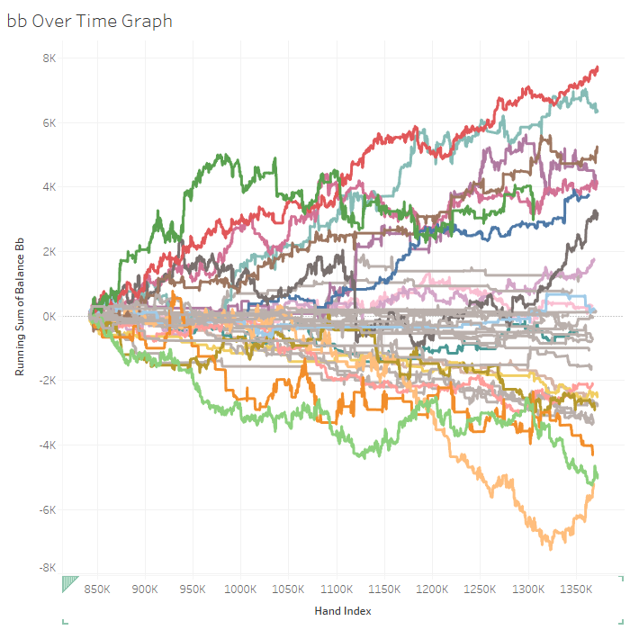
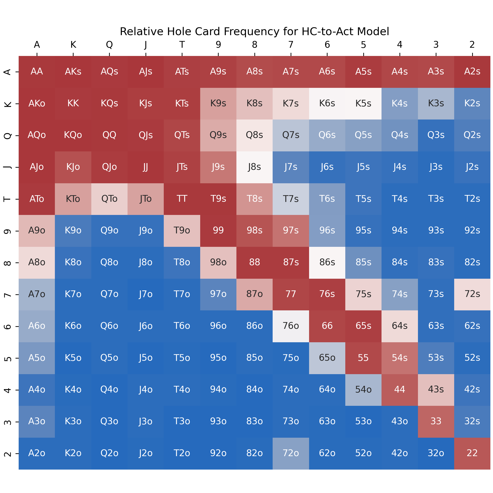
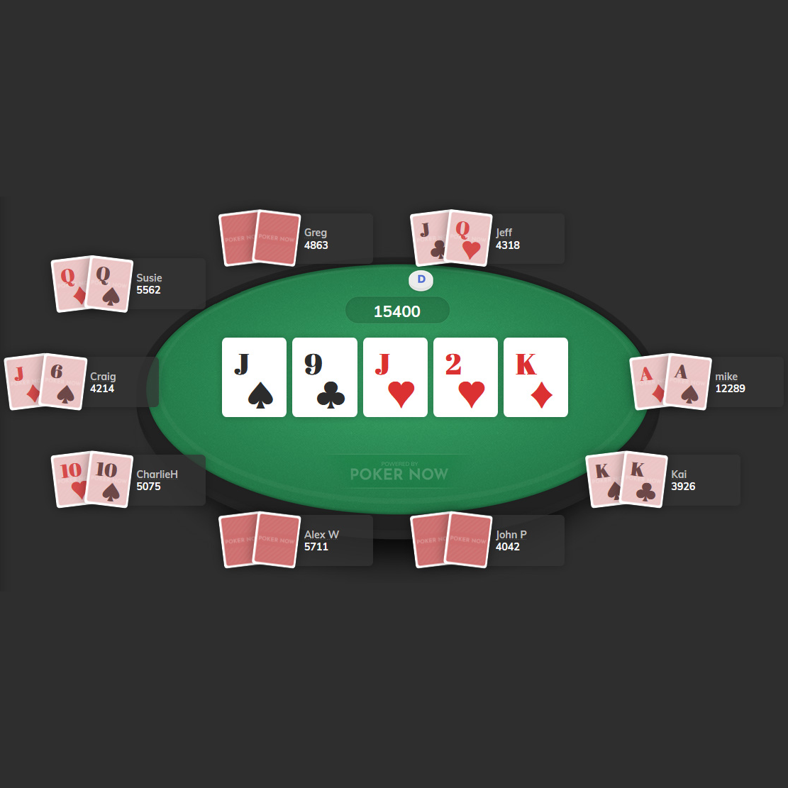

# Projects

Welcome to my data science portfolio! Each project listed below contains a link to an individual project page with a more in-depth description.

### TL;DR
Short on time? Try these first:

- Interactive visuals and pretty graphs: [Poker Visualization](visualization)
- Developing a fun ML model: [Poker AI and Machine Learning Insights](ai)

---

## [Poker Visualization](visualization)
Tableau dashboard and workbook to visualize poker player strategies and statistics for better decision-making

  
---
  
## [Poker AI and Machine Learning Insights](ai)
A set of projects that leverage machine learning and AI to derive advanced insights about poker strategy

   
---

## [Published Social Science Research](nature)
Peer-reviewed study that uses mixed quantitative and qualitative analysis to demonstrate that higher education can foster connectedness to nature

<a href="nature">
  
---

## [Student Risk Model](cbe)
Multi-stage optimization and logistic regression model to identify at-risk students
  

  
---

## [Faculty Prioritization Model](faculty)
Mixed effects model to rank faculty who contribute the most to student success
  
 

---

## [bFusion Behavior Model](bfusion)
Multi-stage factor analysis and gradient boosting model to predict student risk at multiple time scales
  
 

---

## [Poker Hand History Parser and Database](parser)
Python program that cleans and parses poker hand histories to load into a SQLite database for further analysis
  

  
---

Since you made it this far, I may as well point you to my [Projects Archive](archive)