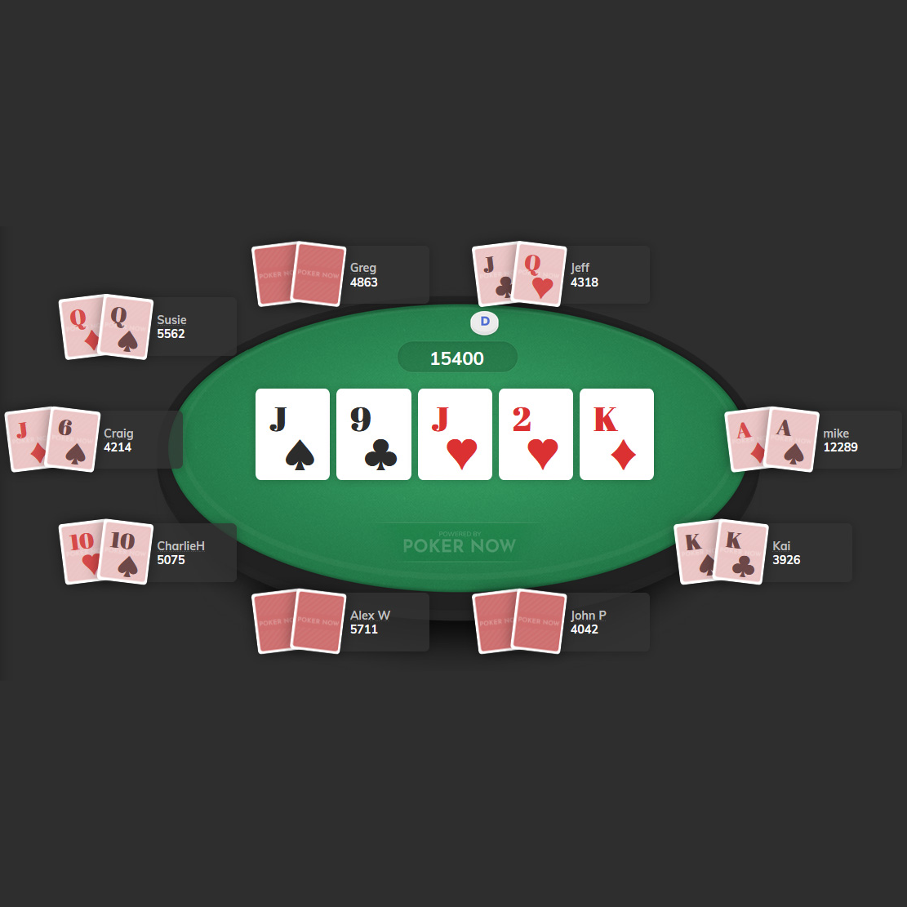
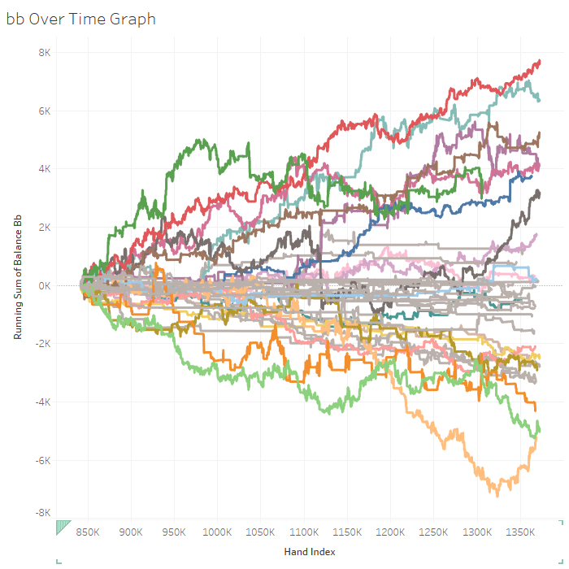

# Projects

Welcome to my data science portfolio! Each project listed below contains a link to an individual project page with a more in-depth description.

### TL;DR
Short on time? Try these first:

- Interactive visuals and pretty graphs: [Poker Visualization](visualization)
- Description of a fun ML model: [Poker AI and Machine Learning Insights](ai)

---

## [Published Social Science Research](nature)
Peer-reviewed study that uses mixed quantitative and qualitative analysis to demonstrate that higher education can foster connectedness to nature

<a href="nature">
  
---

## [Poker Hand History Parser and Database](parser)
Python program that cleans and parses poker hand histories to load into a SQLite database for further analysis
  

  
---
  
## [Poker Visualization](visualization)
Tableau dashboard and workbook to visualize poker player strategies and statistics for better decision-making

  
---
  
## [Poker AI and Machine Learning Insights](ai)
Works in progress that leverage machine learning and AI to derive advanced insights about poker strategy

   
---
  
## [Dynamic Gradebook](gradebook)
28-sheet workbook using Google Sheets to collate student grades, instructor feedback, and peer feedback for automated mail merge grade reports

---
  
## [NCAA March Madness Pool Optimizer](ncaa)
Java program that picks the optimal NCAA basketball tournament bracket for a typical office pool

