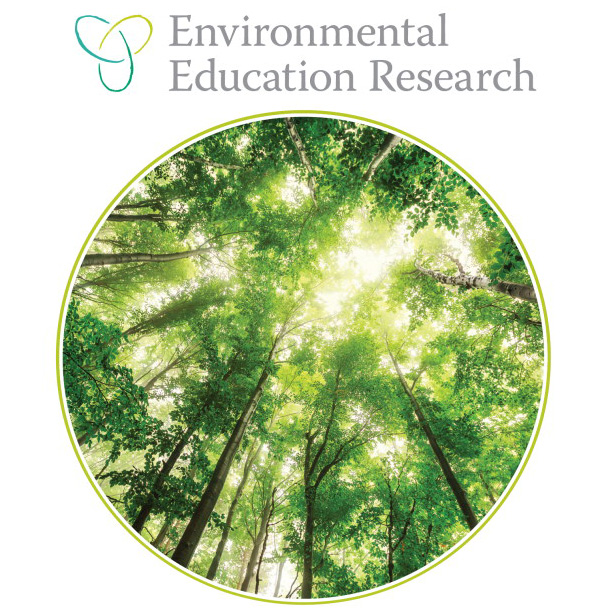

# Published Social Science Research

## Overview

Peer-reviewed study that uses mixed quantitative and qualitative analysis to demonstrate that higher education can foster connectedness to nature  

> Lankenau, Greg. 2018. “Fostering Connectedness to Nature in Higher Education.” *Environmental Education Research* 24 (2): 230–44. doi:10.1080/13504622.2016.1225674

Link to study: [Fostering Connectedness to Nature in Higher Education](https://doi.org/10.1080/13504622.2016.1225674)

### Skills
- Research Design
- Statistical and Numerical Analysis
- Data Analysis
- Writing and Communication

### Background

As an academic researcher, my area of focus is environmental sustainability, especially the connection between sustainability and individual and collective identity. This is a published, peer-reviewed social science study that uses mixed methods (primarily quantitative) to query whether higher education can foster connectedness to nature. Connectedness to nature is the perception of being part of, rather than separate from, the natural world.

## Project Description

This study examines an introductory college-level ecology course for non majors in which fostering connectedness and a fuller relationship with nature is one of the primary goals. The course features reflective assignments, peer-led discussions, and interactive activities. Using pre-and post-test measurements of Nature Relatedness and supplemental interviews, the study addresses the question of whether a course like this can increase learners’ connectedness to nature, both independently and in comparison to similar courses.

The results show that the course significantly increased participants’ connectedness, particularly their identification with nature and nature-focused worldview. Other environmental courses studied demonstrated no such changes, suggesting that environmental education does not automatically lead to connectedness; the key difference is likely an intentional focus on connectedness in the goals and approach of the course.

### The Take-Away Message

If woven into the goals and approach of teaching, connectedness to nature can indeed be fostered in higher education. This is an informative result for environmental scholars and educators, as well as an inspiring one. The path to a sustainable future is long and difficult; environmental education that fosters connectedness to nature can aid us on this journey.

Link to study: [Fostering Connectedness to Nature in Higher Education](https://doi.org/10.1080/13504622.2016.1225674)
