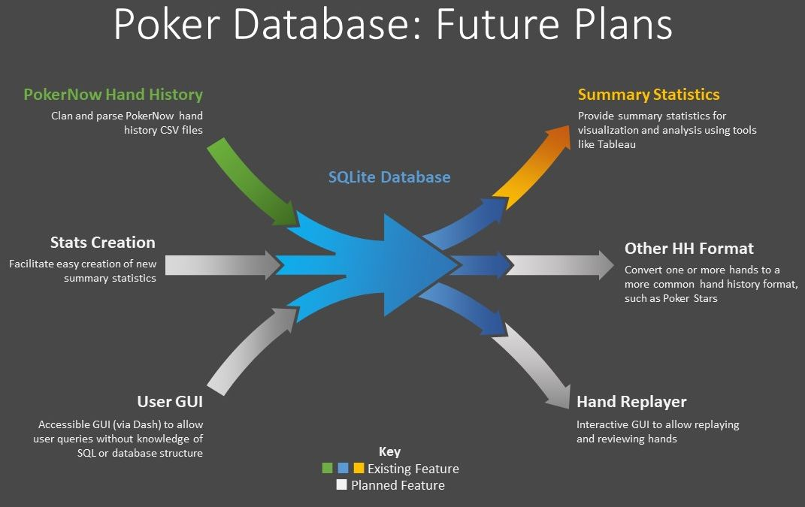

# NCAA March Madness Pool Optimizer

## Overview

Java program that picks the optimal NCAA basketball tournament bracket for a typical office pool  

### Skills
- Programming (Java, Python)
- Data analysis (Pandas)
- Communication and storytelling

Yes, storytelling. Humans make meaning out of stories, which is true whether the stories are told through TV shows, books, or data science reports. This page tells the story of my NCAA March Madness Pool Optimizer, its creation from the luckiest NCAA postseason imaginable, its lurching evolution, and its recent existential crisis.

This story is way (way) more elaborate and embellished than it needs to be, but I wanted to have fun with it and provide a glimpse into what I'm like as a person and how I communicate. (For another example of my communication style, see my [COVID-19 Communication](covid) page.)

### Background

I don't know anything about NCAA college basketball. I don't watch it, I don't follow it, I don't pay any attention at all to it... except in March, when the annual NCAA tournament rolls around. And when the March Madness tournament rolls around, so, too, do the plethora of casual "office" pools, where a bunch of chumps like me compete with each other to see who can put together the most accurate bracket of predicted winning teams.

*Aside: I actually did know something about NCAA college basketball once. When I was in college, I played on the practice squad for the Colorado State women's basketball team for two years, running opponents' plays and participating in drills and scrimmages. I followed the team fanatically and absorbed a lot of firsthand knowledge about other teams. And you're damn right I won the women's tournament pool by a landslide.*

The question: How do you put together an optimal NCAA March Madness bracket while knowing nothing about college basketball?

The answer: Scrape some data and write a program, of course.

## Project Description

I wrote a hand history parser in Python to clean the PokerNow hand history CSV files and load them into a SQLite database. One of the challenges is that the hand histories are not standardized and change over time as features are added or modified on PokerNow. Additionally, sometimes player actions are missing in the hand histories, which meant that I had to use my domain knowledge of poker to build an internal logic into the parser that recognizes when an action is missing or incorrect and automatically corrects it when possible.

The resulting SQLite database can be queried for analysis, and is used as the basis for the Poker Visualization and Poker AI and Machine Learning Insights projects.

### Future Plans

This project started as a personal project for my poker group, but I would like to expand it and make the code publicly available as open-source on GitHub. I plan to add a more robust set of database inputs and outputs, such as a GUI for the database so users can look up queries without having to know SQL or the database structure, and a hand history converter that can output hands to a more common hand history format, like Poker Stars, so players can convert their PokerNow hand histories to a format that is more widely recognized by other software tools.

*Flowchart adapted from [Multi Input Output Process](https://poweredtemplate.com/multi-input-output-process-80158/)*
