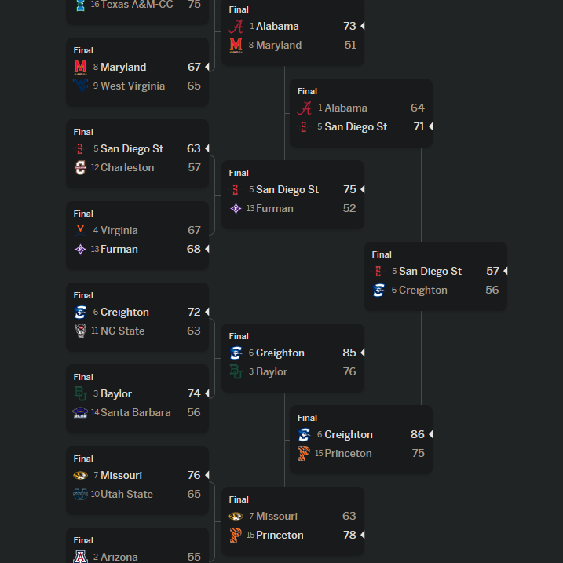

# NCAA March Madness Pool Optimizer

## Overview

Java program that picks the optimal NCAA basketball tournament bracket for a typical office pool  

### Skills
- Programming (Java, Python)
- Data analysis (Pandas)
- Communication and storytelling (this silly page)

Humans make meaning out of stories, which is true whether the stories are told through TV shows, books, or data science reports. This page takes the idea of data science as storytelling literally! Here I tell the story of my NCAA March Madness pool optimizer, including its creation from the luckiest NCAA bracket imaginable, its lofty heights, its lurching evolution, and its recent existential crisis.

This story is way (way) more elaborate and embellished than it needs to be, but I wanted to have fun with it and provide a glimpse into what I'm like as a person and how I communicate. (For another example of my communication style, see my [COVID-19: What You Can Do](covid) page.) Let's dive in!

### Background

I don't know anything about NCAA college basketball. I don't watch it, I don't follow it, I don't pay any attention at all to it... except in March, when the annual NCAA tournament rolls around. The March Madness tournament means casual March Madness "office" pools! That's where a bunch of chumps like me compete with each other to see who can put together the most accurate bracket of predicted winning teams while knowing nothing about college basketball.

*Aside: I actually did know something about NCAA basketball once. When I was in college, I played on the practice squad for the Colorado State women's basketball team for two years, running opponents' plays and participating in drills and scrimmages. As a practice squad player and a fan, I absorbed a lot of firsthand knowledge about other teams. And you're damn right I won the women's tournament pool by a landslide my first year. (No one has joined a women's tournament pool with me since.)*

Other than that flash of knowledge from playing on the Colorado State practice squad, I have not followed, and do not follow, NCAA college basketball at all. The question: How do you put together an optimal NCAA March Madness bracket while knowing nothing about college basketball?

The answer: Scrape some data and write a program, of course.

## Project Description

The story of this project has a beginning, a middle, and (possibly) an end.

### The Lucky Beginning

In the beginning, this project didn't actually start as a NCAA March Madness bracket optimizer. It started because I happened to do extraordinarily well one year in my regular men's tournament pool. After the first weekend of games, I was in first place out of about 60 entries in the pool, which I thought was such an accomplishment that I took a screenshot, drew a big red circle in MS Paint, and sent it to anyone who cared (which was almost certainly less than or equal to one person):

I wanted to know which teams I should root for in the upcoming weekend of games in order to keep my unexpected first-place run alive. I thought there might be some unintuitive rooting interests, such as rooting against a team that I picked to win a game because that team's losing might hurt my closest competition more.

To find out, I wrote a rough-and-tumble Java program that enumerated all possible outcomes of the tournament (it simply gave each team a 50/50 chance to win each game), and for each outcome compared the resulting score of my bracket to the scores of my closest competition. From there it determined the teams I most needed to root for and the teams I most needed to root against.

But... plot twist! My luck from the first weekend went into overdrive, and the teams I had picked just kept winning. From the Sweet Sixteen onward, my bracket actually picked *all but one game* correctly. Out of the million-plus entries on ESPN, my bracket was in the double digit ranks (I want to say it hit the teens at its peak, but did I take a screenshot of *that*? Nooo...). Of course, I won my pool running away, and didn't even need to reference my little Java program.

To this day this stupid March Madness bracket remains my luckiest accomplishment. I finished above the 99.99th percentile in an NCAA tournament pool without knowing anything about college basketball. Could I have used this luck to win the lottery instead? Nooo...

### The Rise of the Optimizer

Each year I continued to expand my humble Java program to include more and more functionality. Finally I made the ultimate upgrade: the ability to output the optimal NCAA March Madness bracket for a typical office pool.

Intuitively, the basic concept is that an optimal bracket should be composed of teams that are likely to win but unlikely to be chosen by other bracket-pickers. If, say, there is a NCAA team with a 20% chance to win the tournament (which is actually quite high in a field of 64+ teams) but 25% of people picked that team to win, then picking that team to win would actually be a losing proposition. In contrast, if there is a team with a 10% chance to win the tournament but only 2% of people picked that team to win, that is a high-value choice and closer to optimal.

In order to find these high-value teams, my program requires two components:
1. A source of "ground truth" probabilities, encapsulating the likelihood of each team winning each game. Nate Silver's FiveThirtyEight March Madness predictions page was perfect for this.
2. A source of "population" picks, encapsulating the frequency of how often each team is chosen by actual bracket-pickers to win each game. ESPN's "Who Picked Whom" page was perfect for this.

Armed with these components, my optimizer program simulates a pool of opponents by creating a set of random entries weighted by the "population" picks. It also simulates a set of tournament outcomes based on the "ground truth" probabilities.

Then, starting with the championship game (because later games are weighted much more heavily in ESPN scoring), the program calculates the expected value of picking each team to win that game. Teams with a high probability of winning but a low frequency of selection have a higher expected value, and the program quantifies this based on the pool's known payout structure. Once it picks the highest-value winner, it sets that choice in place for all the necessary games, then moves on to determine the highest-value team of the next game.

The program repeats the process for a set number of simulated tournament outcomes and a set number of simulated opponent pools. Then it collates the values across all simulations to find the optimal bracket. If you don't like putting all your eggs (or basketballs?) in one basket, the program can also output an arbitrary number of alternative brackets that assume that your other bracket(s) did not win, therefore increasing the number of scenarios where you walk away from the March Madness tournament a happy winner. Neat!

The first year I used the optimizer program I created two brackets for my regular 60-entry pool. My primary bracket ("Value Bets") won the pool and my non-overlapping secondary bracket also nearly finished in the money (heading into the Final Four, there was a plausible scenario where my brackets would take first and third). This game is easy! My program was going to take over the world!

### The Optimizer Struggles

*Narrator: This game is not easy. His program did not take over the world.*

After the commanding victory its first year, the bracket optimizer struggled to have that kind of performance again. There was an especially bleak run of a few years where I would enter multiple non-overlapping brackets into the pool, overlooking just one or two good teams, and somehow those one or two overlooked teams were the ones that ended up winning. These are actual quotes from actual emails I actually wrote after identifying which team(s) the program overlooked:
- "So... North Carolina over West Virginia?" (tournament winner: North Carolina)
- "Anybody but Villanova, right? Right?" (tournament winner: Villanova)
- "Yes! Bring on Duke over Wisconsin! (tournament winner: Duke over Wisconsin)

This is a good illustration of how probabilities aren't certainties, especially when even a high-value team is often around only 10% to win the tournament. No amount of data, and no amount of algorithmic wizardry, can deliver certainty when the range of likely outcomes is wide.

Then there was that year where the optimizer *would* have picked a winning bracket, except I manually switched a few games around to produce an outcome that I thought made more sense. Oops. Never again! Obey the machines without question! (Actually, this is terrible advice in general, but seeing as I don't know anything about college basketball... I have obeyed the machine ever since.)

### The (Possible) End of the Optimizer

There's this famous mansion, the [Winchester Mystery House](http://www.smithsonianmag.com/history/heiress-gun-empire-built-mansion-forever-haunted-blood-money-built-it-180959712/), that belonged to Sarah Winchester of Winchester rifle fame. Convinced that the ghosts of people killed by Winchester rifles would never rest unless she kept building and re-building the house, she had additions and renovations added to the house pretty much continuously for decades. There are completely closed-off rooms, doors that open to nothing but air, and stairs that lead to nowhere.

My NCAA bracket optimizer program is a lot like that.

Once a year, I resurrect the program and add something to it. Unfortunately, given that (A) I only work on it once a year, (B) it's always written in haste as the NCAA tournament approaches, (C) it was never intended to perform all the functions that it currently does, and (D) at no point did I take into account any design considerations or long-term plans, it is a monstrous, hot mess. Each year when I return to it, it's like re-learning the path through a labyrinth. What does this part even do? (On the bright side, it's one of the most well-commented pieces of code the world has ever seen, like the guy in [Memento](https://www.imdb.com/title/tt0209144/) writing notes to his future amnesiac self.)

In 2024 I decided to rewrite the optimizer from the ground up using Python. I planned out the structure, anticipated current and future functionality, and took advantage of modern data science libraries like Pandas and Beautiful Soup. I even automated some of the tedious work that I used to have to do manually, like scraping the most recent game results.

And then, somehow, for some reason, in a complete reversal of fortune from the red-hot tournament run that started this whole program, this was the year that ESPN stopped publishing their "Who Picked Whom" page of population picks *and* Nate Silver moved his March Madness predictions behind a paywall. (I'm fine with paying Silver for his hard work, but ESPN's killing the "Who Picked Whom" page is unforgiveable.)

Sadly, my NCAA March Madness pool optimizer is now sitting on the digital shelf, collecting digital dust.

### The Take-Away Message

Apart from the lessons about not building labrythine code that turns into the Winchester Mystery House, this project is a good illustration in how good data science is always at the mercy of good data. How do you put together an optimal NCAA March Madness bracket while knowing nothing about college basketball and not being able to access the necessary data?

I don't know what the future holds for my NCAA March Madness bracket optimizer. Can I hack together enough population data from sources like Yahoo (not nearly as popular as ESPN)? Can I justify paying to access Nate Silver's probabilities when it costs more than an entry to my regular office pool?

If not, I guess there's always the possibility of returning to my roots and getting absurdly lucky. Come on, 99.99th percentile lottery ticket!

Now that would be a good story.
