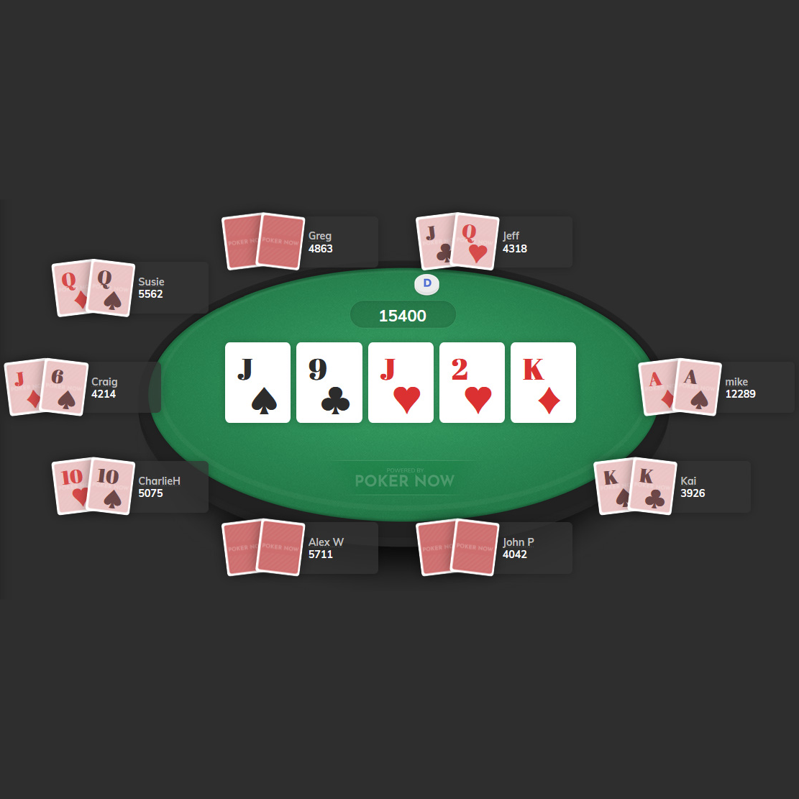
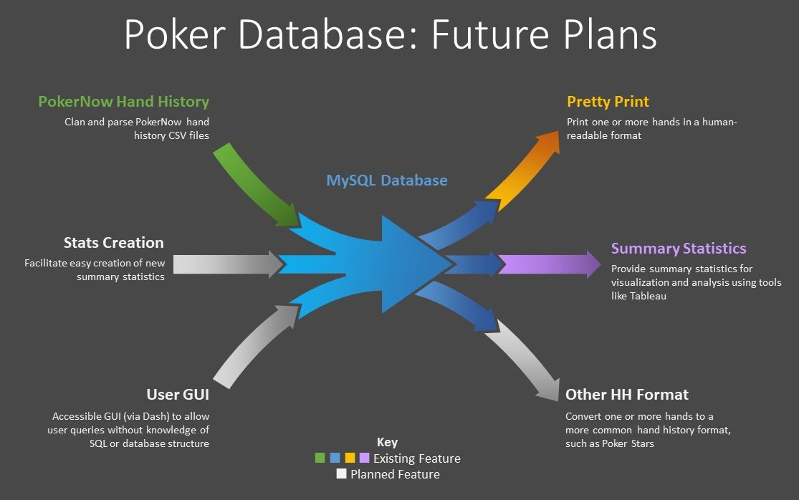

# Poker Hand History Parser and Database

## Overview

Python program that cleans and parses poker hand histories to load into a SQLite database for further analysis

The database is used as the basis for the [Poker Visualization](visualization) and [Poker AI and Machine Learning Insights](ai) projects

### Skills
- Programming (Python)
- Relational databases (SQLite)

### Background

I have been playing poker (no limit Texas hold 'em) online with a group of friends at least twice a week since spring 2020. We play using the online platform, PokerNow, which provides downloadable hand histories that contain a record of all the hands that the group played and all the players' actions that happened within them. Per year, we play approximately 100,000 hands with a total of approximately 1.35 million player actions.

Beginning in January, 2021, I started downloading the hand histories after each session in order to save them for group record-keeping and analysis.

## Project Description

I wrote a hand history parser in Python to clean the PokerNow hand history CSV files and load them into a SQLite database. One of the challenges is that sometimes player actions are missing in the hand histories, which meant that I had to use my domain knowledge of poker to build an internal logic into the parser that recognizes when an action is missing or incorrect and automatically corrects it when possible.

The resulting SQLite database can be queried for information and analysis.

### Future Plans

This project started as a personal project for my poker group, but I would like to expand it and make the code publicly available as open-source on GitHub. I plan to add a more robust set of database inputs and outputs, such as a GUI for the database so users can look up queries without having to know SQL or the database structure, and a hand history converter that can output hands to a more common hand history format, like Poker Stars, that is more widely recognized by other software tools.

*Flowchart adapted from [Multi Input Output Process](https://poweredtemplate.com/multi-input-output-process-80158/)*

### The Take-Away Message

This project uses Python and a SQLite database to convert poker hands and actions into a recorded format that can be stored, accessed, and queried. The database currently provides for analysis through SQL queries and Tableau visualization, with plans for additional input and output functionality.
