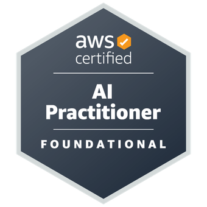

# Skills and Certifications

This is a short list of my most relevant skills and certifications for data science. Underneath each skill is a project or award that best illustrates that skill. The projects are the same as those on [Projects (Home)](/) page; some projects are listed under more than one skill.

## Technical Skills

- **Programming:** Python, R, Java
    - Includes programming tools like Git, Jupyter Notebooks, and Docker
    - Most of the projects below demonstrate programming skills
- **Statistical and Numerical Analysis:** Pandas, NumPy, Excel, SPSS, NVivo, MATLAB/Octave
    - [Published Social Science Research](nature)
- **Machine Learning and Deep Learning:** scikit-learn, XGBoost, Keras/TensorFlow
    - [Poker AI and Machine Learning Insights](ai)
	- [bFusion Behavior Model](bfusion)
- **Cloud Computing and AWS Deployment:** AWS SageMaker, Apache Airflow
	- [Student Risk Model](cbe)
- **Relational Databases:** SQL (Amazon Redshift/PostgreSQL, MySQL, SQLite)
    - [Poker Hand History Parser and Database](parser)
- **Data Visualization:** Tableau, matplotlib, Seaborn, Plotly/Dash
    - [Poker Visualization](visualization)

## Research and Communication Skills

- **Research Design**
    - [Published Social Science Research](nature)
- **Writing and Communication**
	- [Poker AI and Machine Learning Insights](ai)
    - [COVID-19: A Data Scientist's Perspective](covid)
- **Public Speaking and Project Management**
    - [Harold F. Martin Graduate Assistant Outstanding Teaching Award](https://gradschool.psu.edu/funding/student-recognition-awards/harold-f-martin-graduate-assistant-outstanding-teaching-award): University-level award for outstanding teaching performance
- **Intellectual Curiosity, Leadership, Service, and Character**
    - [Boettcher Foundation Scholarship](https://boettcherfoundation.org/scholarships/prospective-scholars/faqs/): Four-year full scholarship to any college or university in Colorado

## Certifications

**[AWS Certified AI Practitioner](https://www.credly.com/badges/69100231-0670-4c32-85e9-786c498a41e2/public_url)**: Validates knowledge of artificial intelligence, machine learning, and generative AI concepts and use cases

**[AWS Certified Machine Learning Engineer](https://aws.amazon.com/certification/certified-machine-learning-engineer-associate/)**: Led workplace professional development training group; exam upcoming

**[IBM Data Science Professional Certificate](https://www.credly.com/badges/d99318dc-807b-4d6d-9850-435f2c6d4f1d/public_url)**: Certifies the ability to use data science tools to solve real-world problems

## The Take-Away Message

I'm a data scientist with a background as a professional educator and researcher. I'm proficient in a range of technical skills, complemented by the ability to communicate complex ideas to non-technical audiences through writing, speaking, and presenting. For more about me, see my [About Me](about) page.