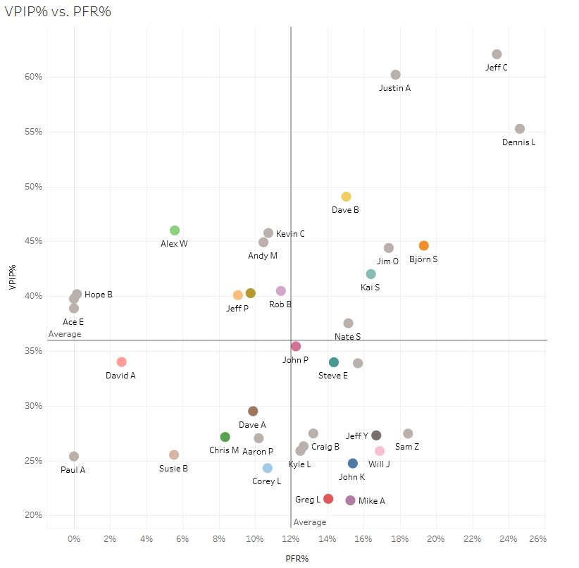

# Poker Visualization

## Overview

Tableau dashboard and workbook to visualize poker player strategies and statistics for better decision-making

View this workbook live on Tableau! [Rebuy Club: Tableau Public](https://public.tableau.com/app/profile/greg4796/viz/RebuyClub/WelcometotheRebuyClub)

### Skills
- Data visualization (Tableau)
- Relational databases (SQL)

### Background

This project builds on my [Poker Hand History Parser and Database](parser). I have a SQLite database of no limit Texas hold 'em hands played with my online poker group since January, 2021.

## Project Description

I created a public Tableau workbook that visualizes key values and summary statistics from the poker database. The database holds all the information since I began downloading hand histories, but the Tableau workbook limits its display to the **most recent 30 days** of play. This was a deliberate design decision made to allow "winners" and "losers" to ebb and flow over time, such that any player can rise to the top and claim the trophy of big winner for the month.

Some of the workbook sheets summarize past information mainly for the purpose of record-keeping and entertainment (and bragging rights, of course). For example:
- A line graph displaying the running total of player wins and losses over time (pictured in the above thumbnail)
- A bar graph displaying average player wins and losses per hand, normalized in terms of big blinds per 100 hands (bb/100)
- A "Nemesis-Hero" table displaying the breakdown of wins and losses of every player against every other player

Other workbook sheets are more strategic in nature and can be used to inform future decision-making in the game. 

### Example Sheet

My favorite strategically-oriented sheet displays a 2D coordinate plane that plots two variables against each other for each player: PFR% (preflop raise; the percentage of times the player raised a hand when given the opportunity) and VPIP% (voluntarily put money into pot; the percentage of times the player chose to play a hand when given the opportunity). PFR% is the horizontal axis, so players more to the right of the graph raised more hands. VPIP% is the vertical axis, so players higher on the graph played more hands.

Together, these two measurements encapsulate a player's playing style and can be used to make better decisions against that player. For example, a player who with a high PFR% (raises a lot) and a high VPIP% (plays many hands) is probably bluffing too often, which can make calling or re-raising that player a better play than folding.

### How To Use the Workbook

All of the graphs and stats in the Tableau workbook are interactive. You can mouse over the lines, click on the lines, and sort tables in ascending or descending order.

Along the top there is a set of tabs you can click to see the different sheets.

In the upper right there is a set of interactive filters. Depending on the sheet, you can filter by date, session number, number of players, number of hands played, and/or big blind amount. For example, moving the "session number" slider all the way to the right will tell the workbook to show only the results from the most recent session. Note that most of the filters apply to all the sheets in the workbook, so if something doesn't look right, double check to make sure the filters are set how you want them.

## The Take-Away Message

Visualization is an effective way to ~~establish bragging rights~~ both summarize what happened in the past and provide strategic insights to inform future decision-making. This public Tableau workbook, accessible to everyone in my poker group, is a handy tool for fun and profit!

Link to workbook: [Rebuy Club: Tableau Public](https://public.tableau.com/app/profile/greg4796/viz/RebuyClub/WelcometotheRebuyClub)
